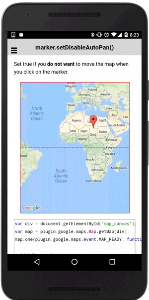

# marker.setDisableAutoPan()

Set true if you **do not want** to move the map when you click on the marker.

```html
<div id="map_canvas"></div>
```

```js
var div = document.getElementById("map_canvas");
var map = plugin.google.maps.Map.getMap(div);
map.one(plugin.google.maps.event.MAP_READY, function() {

  // Add a marker
  map.addMarker({
    'position': {
      lat: 20,
      lng: 20
    },
    'animation': plugin.google.maps.Animation.BOUNCE,
    'title': 'The map does not move when you click on this marker.'
  }, function(marker) {

    // Disable marker auto panning.
    marker.setDisableAutoPan(true);

  });
});
```


