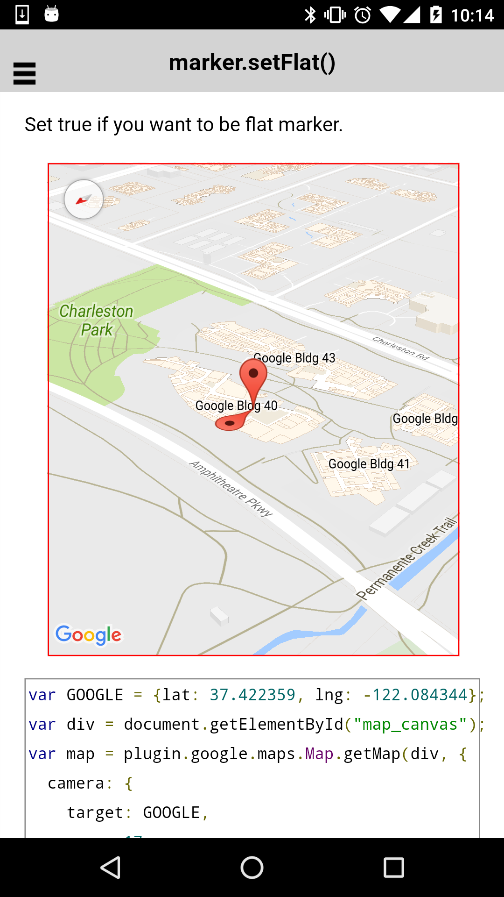

:warning: **This document is aim for older versions (from 2.0.0 to 2.2.9).
Document for new version is https://github.com/mapsplugin/cordova-plugin-googlemaps-doc/blob/master/v2.6.0/README.md**

# marker.setFlat()


Set true if you want to be flat marker.

```html
<div id="map_canvas"></div>
```

```js
var GOOGLE = {lat: 37.422359, lng: -122.084344};
var div = document.getElementById("map_canvas");
var map = plugin.google.maps.Map.getMap(div, {
  camera: {
    target: GOOGLE,
    zoom: 17,
    tilt: 60,
    bearing: 140
  }
});
map.one(plugin.google.maps.event.MAP_READY, function() {


  // Default marker
  map.addMarker({
    position: GOOGLE
  });

  // Flat marker
  map.addMarker({
    position: GOOGLE,
    flat : false     // You can also specify with this property
  }, function(marker) {

    // Marker is going to be flat (like ground overlay)
    marker.setFlat(true);

  });


});
```


