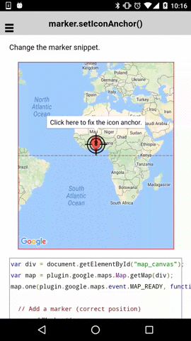

# marker.setIconAnchor()

Change the marker anchor position.

```html
<div class="map" id="map_canvas"></div>
```

```js
var div = document.getElementById("map_canvas");
var map = plugin.google.maps.Map.getMap(div);
map.one(plugin.google.maps.event.MAP_READY, function() {

  // Add a marker (correct position)
  map.addMarker({
    'position': {
      lat: 0,
      lng: 0
    },
    'zIndex' : 2
  });

  // Add a marker
  map.addMarker({
    'position': {
      lat: 0,
      lng: 0
    },
    'icon': "./target_icon.png",
    'title': 'Click here to fix the icon anchor.',
    'zIndex': 1
  }, function(marker) {

    // Open the infoWindow
    marker.showInfoWindow();

    // Catch the MARKER_CLICK evnet
    marker.on(plugin.google.maps.event.INFO_CLICK, function() {

      // Change the icon anchor.
      // Set icon anchor point as 24x24 px from the left-top.
      marker.setIconAnchor(24, 24);

      // Change the marker title.
      marker.setTitle("Ta-da!");
      marker.setSnippet("The marker should be the correct position.");

      // Redraw (reopen) the infoWindow.
      marker.showInfoWindow();

    });
  });
});
```


