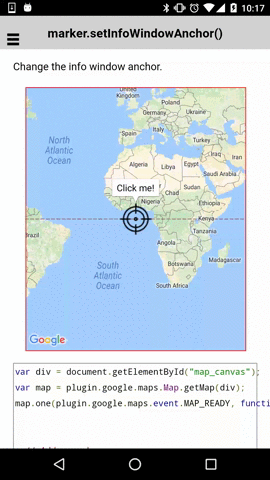

# marker.setInfoWindowAnchor()

Change the info window anchor.

```html
<div id="map_canvas"></div>
```

```js
var div = document.getElementById("map_canvas");
var map = plugin.google.maps.Map.getMap(div);
map.one(plugin.google.maps.event.MAP_READY, function() {


  // Add a marker
  map.addMarker({
    'position': {
      lat: 0,
      lng: 0
    },
    'icon': {
      'url': './target_icon.png',
      'anchor': [24, 24]
    },
    'title': 'Click me!'
  }, function(marker) {

    // Open the infoWindow
    marker.showInfoWindow();

    marker.on(plugin.google.maps.event.INFO_CLICK, function() {

      // Set the infoWindow anchor at 24x24px from the left-top of the icon.
      marker.setInfoWindowAnchor(24, 24);

    });
  });
});
```


