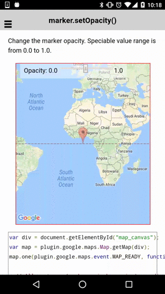

:warning: **This document is aim for older versions (from 2.0.0 to 2.2.9).
Document for new version is https://github.com/mapsplugin/cordova-plugin-googlemaps-doc/blob/master/v2.6.0/README.md**

# marker.setOpacity()

Change the marker opacity. Speciable value range is from 0.0 to 1.0.

```html
<div class="map" id="map_canvas">
  <span  class="smallPanel">
    Opacity: 0.0&nbsp;<input id="opacityRange" type="range" min="0" max="1" step="0.1">&nbsp;1.0
  </span>
</div>
```

```js
var div = document.getElementById("map_canvas");
var map = plugin.google.maps.Map.getMap(div);
map.one(plugin.google.maps.event.MAP_READY, function() {

  // All gestures (such as pinch-zooming) are disabled.
  map.setAllGesturesEnabled(false);

  // Add a marker
  map.addMarker({
    'position': {
      lat: 0,
      lng: 0
    }
  }, function(marker) {

    var range = document.getElementById("opacityRange");
    range.addEventListener("change", function() {

      // Set the current value as opacity.
      marker.setOpacity(parseFloat(this.value));
    });

    // Set the current value as opacity.
    marker.setOpacity(range.value);

  });
});
```


