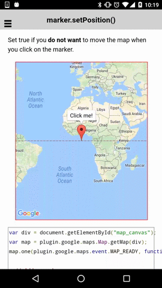

:warning: **This document is aim for older versions (from 2.0.0 to 2.2.9).
Document for new version is https://github.com/mapsplugin/cordova-plugin-googlemaps-doc/blob/master/v2.6.0/README.md**

# marker.setPosition()

Set the marker position.

```html
<div id="map_canvas"></div>
```

```js
var div = document.getElementById("map_canvas");
var map = plugin.google.maps.Map.getMap(div);
map.one(plugin.google.maps.event.MAP_READY, function() {

  // Add a marker
  map.addMarker({
    'position': {
      lat: 0,
      lng: 0
    },
    'title': 'Click me!'
  }, function(marker) {

    // Show the infoWindow.
    marker.showInfoWindow();

    marker.on(plugin.google.maps.event.INFO_CLICK, function() {

      // Change the marker position.
      marker.setPosition({
        lat: 20,
        lng: 20
      });

    });

  });
});
```


