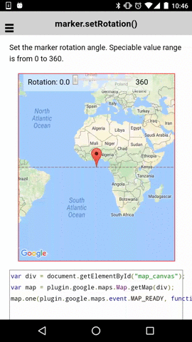

# marker.setRotation()

Set the marker rotation angle. Speciable value range is from 0 to 360.

```html
<div id="map_canvas">
  <span class="smallPanel">
    Rotation: 0.0&nbsp;<input id="rotationRange" type="range" min="0" max="360" step="10" value="0">&nbsp;360
  </span>
</div>
```

```js
var div = document.getElementById("map_canvas");
var map = plugin.google.maps.Map.getMap(div);
map.one(plugin.google.maps.event.MAP_READY, function() {


  // Add a marker
  map.addMarker({
    'position': {
      lat: 0,
      lng: 0
    }
  }, function(marker) {

    var range = document.getElementById("rotationRange");
    range.addEventListener("change", function() {

      // Set the marker rotation angle.
      marker.setRotation(parseInt(this.value));
    });

    // Set the current value as rotation angle.
    marker.setRotation(range.value);

  });
});
```


