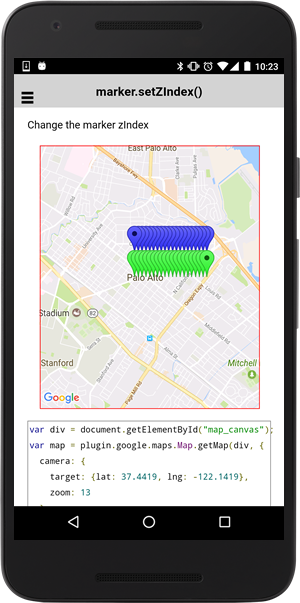

:warning: **This document is aim for older versions (from 2.0.0 to 2.2.9).
Document for new version is https://github.com/mapsplugin/cordova-plugin-googlemaps-doc/blob/master/v2.6.0/README.md**

# marker.setZIndex()

Change the marker zIndex

```html
<div id="map_canvas"></div>
```

```js
var div = document.getElementById("map_canvas");
var map = plugin.google.maps.Map.getMap(div, {
  camera: {
    target: {lat: 37.4419, lng: -122.1419},
    zoom: 13
  }
});
map.one(plugin.google.maps.event.MAP_READY, function() {

  // Get the current visible region
  var latLngBounds = map.getVisibleRegion();
  var centerLat = latLngBounds.getCenter().lat;
  var centerLng = latLngBounds.getCenter().lng-0.005;
  for (var i = 1; i <= 20; i++) {

    map.addMarker({
      position: {
        lat: centerLat,
        lng: centerLng+0.001*i
      },
      icon: "green",
      zIndex: i
    });

    map.addMarker({
      position: {
        lat: centerLat+0.005,
        lng: centerLng+0.001*i
      },
      icon: "blue",
      zIndex: -i
    });
  }

});
```


