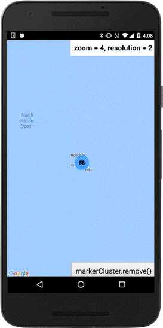

:warning: **This document is aim for older versions (from 2.0.0 to 2.2.9).
Document for new version is https://github.com/mapsplugin/cordova-plugin-googlemaps-doc/blob/master/v2.6.0/README.md**

# map.addMarkerCluster()

The map.addMarkerCluster() method takes a single options object literal, specifying the initial properties of the marker.

You need to configure **require parameters**:
- `markers`: Array of marker options (not actual markers)
- `icons`: Array of conditions for cluster icon

And other optional parameters are:

- `boundsDraw`: draw bounds when you tap on a clustered marker (default: true)
- `maxZoomLevel`: maximum zoom level of clustering (default: 15, max: 18)


## Add a marker cluster

```html
<div class="map" id="map_canvas">
    <span class="smallPanel" id="label"></span>
</div>
```

```js
var options = {
    'camera': {
        'target': dummyData()[0].position,
        'zoom': 12
    }
};
var map = plugin.google.maps.Map.getMap(mapDiv, options);
map.on(plugin.google.maps.event.MAP_READY, function() {

  var label = document.getElementById("label");

  //------------------------------------------------------
  // Create a marker cluster.
  // Providing all locations at the creating is the best.
  //------------------------------------------------------
  map.addMarkerCluster({
    //maxZoomLevel: 5,
    boundsDraw: true,
    markers: dummyData(),
    icons: [
        {min: 2, max: 100, url: "./img/blue.png", anchor: {x: 16, y: 16}},
        {min: 100, max: 1000, url: "./img/yellow.png", anchor: {x: 16, y: 16}},
        {min: 1000, max: 2000, url: "./img/purple.png", anchor: {x: 24, y: 24}},
        {min: 2000, url: "./img/red.png",anchor: {x: 32,y: 32}}
    ]
  }, function (markerCluster) {

      //-----------------------------------------------------------------------
      // Display the resolution (in order to understand the marker cluster)
      //-----------------------------------------------------------------------
      markerCluster.on("resolution_changed", function (prev, newResolution) {
          var self = this;
          label.innerHTML = "&lt;b&gt;zoom = " + self.get("zoom").toFixed(0) + ", resolution = " + self.get("resolution") + "&lt;/b&gt;";
      });
      markerCluster.trigger("resolution_changed");

      //------------------------------------
      // If you tap on a marker,
      // you can get the marker instnace.
      // Then you can do what ever you want.
      //------------------------------------
      var htmlInfoWnd = new plugin.google.maps.HtmlInfoWindow();
      markerCluster.on(plugin.google.maps.event.MARKER_CLICK, function (position, marker) {
        var html = [
          "&lt;div style='width:250px;min-height:100px'&gt;",
          "&lt;img src='img/starbucks_logo.gif' align='right'&gt;",
          "&lt;strong&gt;" + (marker.get("title") || marker.get("name")) + "&lt;/strong&gt;"
        ];
        if (marker.get("address")) {
          html.push("&lt;div style='font-size:0.8em;'&gt;" + marker.get("address") + "&lt;/div&gt;");
        }
        if (marker.get("phone")) {
          html.push("&lt;a href='tel:" + marker.get("phone") + "' style='font-size:0.8em;color:blue;'&gt;Tel: " + marker.get("phone") + "&lt;/div&gt;");
        }
        html.push("&lt;/div&gt;");
        htmlInfoWnd.setContent(html.join(""));
        htmlInfoWnd.open(marker);
      });

  });
});
function dummyData() {
  return [
    {
      "position": {
        "lat": 21.382314,
        "lng": -157.933097
      },
      "name": "Starbucks - HI - Aiea  03641",
      "address": "Aiea Shopping Center_99-115 Aiea Heights Drive #125_Aiea, Hawaii 96701",
      "phone": "808-484-0000",
      "icon": "./img/starbucks.png"
    },
    {
      "position": {
        "lat": 21.3871,
        "lng": -157.9482
      },
      "name": "Starbucks - HI - Aiea  03642",
      "address": "Pearlridge Center_98-125 Kaonohi Street_Aiea, Hawaii 96701",
      "phone": "808-484-0000",
      "icon": "./img/starbucks.png"
    },
    {
      "position": {
        "lat": 21.363402,
        "lng": -157.928275
      },
      "name": "Starbucks - HI - Aiea  03643",
      "address": "Stadium Marketplace_4561 Salt Lake Boulevard_Aiea, Hawaii 96818",
      "phone": "808-488-0000",
      "icon": "./img/starbucks.png"
    },
    {
      "position": {
        "lat": 21.3884,
        "lng": -157.9431
      },
      "name": "Starbucks - HI - Aiea  03644",
      "address": "Pearlridge Mall_98-1005 Moanalua Road_Aiea, Hawaii 96701",
      "phone": "808-484-0000",
      "icon": "./img/starbucks.png"
    },
    {
      "position": {
        "lat": 21.6507,
        "lng": -158.0652
      },
      "name": "Starbucks - HI - Haleiwa  03645",
      "address": "Pupukea_59-720 Kamehameha Highway_Haleiwa, Hawaii 96712",
      "phone": "808-638-0000",
      "icon": "./img/starbucks.png"
    },
    {
      "position": {
        "lat": 19.699335,
        "lng": -155.06566
      },
      "name": "Starbucks - HI - Hilo  03646",
      "address": "Border Waiakea Center_315-325 Makaala Street_Hilo, Hawaii 96720",
      "icon": "./img/starbucks.png"
    },
    {
      "position": {
        "lat": 19.698399,
        "lng": -155.064864
      },
      "name": "Starbucks - HI - Hilo  03647",
      "address": "Prince Kuhio Plaza_111 East Puainako Street_Hilo, Hawaii 96720",
      "phone": "808-959-0000",
      "icon": "./img/starbucks.png"
    },
    {
      "position": {
        "lat": 19.722763,
        "lng": -155.085598
      },
      "name": "Starbucks - HI - Hilo [D]  03648",
      "address": "Hilo_438 Kilauea Ave_Hilo, Hawaii 96720",
      "phone": "808-933-0000",
      "icon": "./img/starbucks.png"
    },
    {
      "position": {
        "lat": 21.338183,
        "lng": -157.917579
      },
      "name": "Starbucks - HI - Honolulu  03649",
      "address": "Airport Trade Center_550 Paiea Street_Honolulu, Hawaii 96819",
      "phone": "808-833-0000",
      "icon": "./img/starbucks.png"
    },
    {
      "position": {
        "lat": 21.3074,
        "lng": -157.865199
      },
      "name": "Starbucks - HI - Honolulu  03650",
      "address": "Aloha Tower_1 Aloha Tower Drive_Honolulu, Hawaii 96813",
      "phone": "808-522-0000",
      "icon": "./img/starbucks.png"
    },
    {
      "position": {
        "lat": 21.30846253,
        "lng": -157.8614898
      },
      "name": "Starbucks - HI - Honolulu  03651",
      "address": "Bishop_1000 Bishop Street #104_Honolulu, Hawaii 96813",
      "phone": "808-599-0000",
      "icon": "./img/starbucks.png"
    },
    {
      "position": {
        "lat": 21.311363,
        "lng": -157.863751
      },
      "name": "Starbucks - HI - Honolulu  03652",
      "address": "Central Pacific Bank_220 South King Street_Honolulu, Hawaii 96813",
      "phone": "808-538-0000",
      "icon": "./img/starbucks.png"
    },
    {
      "position": {
        "lat": 21.28507546,
        "lng": -157.838214
      },
      "name": "Starbucks - HI - Honolulu  03653",
      "address": "Discovery Bay_1778 Ala Moana Boulevard_Honolulu, Hawaii 96815",
      "phone": "808-946-0000",
      "icon": "./img/starbucks.png"
    },
    {
      "position": {
        "lat": 21.342733,
        "lng": -158.027408
      },
      "name": "Starbucks - HI - Honolulu  03654",
      "address": "Ewa Beach_91-1401 Fort Weaver Road_Honolulu, Hawaii 96706",
      "phone": "808-685-0000",
      "icon": "./img/starbucks.png"
    },
    {
      "position": {
        "lat": 21.28005068,
        "lng": -157.8285093
      },
      "name": "Starbucks - HI - Honolulu  03655",
      "address": "Duty Free Shopper_330 Royal Hawaiian Avenue_Honolulu, Hawaii 96815",
      "phone": "808-926-0000",
      "icon": "./img/starbucks.png"
    },
    {
      "position": {
        "lat": 21.3115,
        "lng": -157.8649
      },
      "name": "Starbucks - HI - Honolulu  03656",
      "address": "Financial Plaza_130 Merchant Street #111_Honolulu, Hawaii 96813",
      "phone": "808-585-0000",
      "icon": "./img/starbucks.png"
    },
    {
      "position": {
        "lat": 21.282048,
        "lng": -157.713041
      },
      "name": "Starbucks - HI - Honolulu  03657",
      "address": "Hawaii Kai Town Center_6700 Kalanianaole Highway_Honolulu, Hawaii 96825",
      "phone": "808-396-0000",
      "icon": "./img/starbucks.png"
    },
    {
      "position": {
        "lat": 21.291345,
        "lng": -157.848791
      },
      "name": "Starbucks - HI - Honolulu  03658",
      "address": "Hokua_1288 Ala Moana Blvd_Honolulu, Hawaii 96814",
      "phone": "808-591-0000",
      "icon": "./img/starbucks.png"
    },
    {
      "position": {
        "lat": 21.335164,
        "lng": -157.868742
      },
      "name": "Starbucks - HI - Honolulu  03659",
      "address": "Kamehameha Shopping Center_1620 North School Street_Honolulu, Hawaii 96817",
      "phone": "808-832-0000",
      "icon": "./img/starbucks.png"
    },
    {
      "position": {
        "lat": 21.27852422,
        "lng": -157.7875773
      },
      "name": "Starbucks - HI - Honolulu  03660",
      "address": "Kahala Mall_4211 Waialae Avenue_Honolulu, Hawaii 96816",
      "phone": "808-737-0000",
      "icon": "./img/starbucks.png"
    },
    {
      "position": {
        "lat": 21.294372,
        "lng": -157.841963
      },
      "name": "Starbucks - HI - Honolulu  03661",
      "address": "Keeaumoku_678 Keeamoku Street #106_Honolulu, Hawaii 96814",
      "phone": "808-946-0000",
      "icon": "./img/starbucks.png"
    },
    {
      "position": {
        "lat": 21.2819,
        "lng": -157.8163
      },
      "name": "Starbucks - HI - Honolulu  03662",
      "address": "Kapahulu Avenue_625 Kapahulu Avenue_Honolulu, Hawaii 96815",
      "phone": "808-734-0000",
      "icon": "./img/starbucks.png"
    },
    {
      "position": {
        "lat": 21.27608195,
        "lng": -157.7049835
      },
      "name": "Starbucks - HI - Honolulu  03663",
      "address": "Koko Marina_7192 Kalanianaole Highway_Honolulu, Hawaii 96825",
      "phone": "808-394-0000",
      "icon": "./img/starbucks.png"
    },
    {
      "position": {
        "lat": 21.3129,
        "lng": -157.8129
      },
      "name": "Starbucks - HI - Honolulu  03664",
      "address": "Manoa Valley_2902 East Manoa Road_Honolulu, Hawaii 96822",
      "phone": "808-988-0000",
      "icon": "./img/starbucks.png"
    },
    {
      "position": {
        "lat": 21.293082,
        "lng": -157.847092
      },
      "name": "Starbucks - HI - Honolulu  03665",
      "address": "Macys Ala Moana_1450 Ala Moan Boulevard_Honolulu, Hawaii 96814",
      "phone": "808-943-0000",
      "icon": "./img/starbucks.png"
    },
    {
      "position": {
        "lat": 21.341957,
        "lng": -157.929089
      },
      "name": "Starbucks - HI - Honolulu  03666",
      "address": "Moanalua Shopping Center_930 Valkenburgh Street_Honolulu, Hawaii 96818",
      "phone": "808-422-0000",
      "icon": "./img/starbucks.png"
    },
    {
      "position": {
        "lat": 21.279503,
        "lng": -157.833101
      },
      "name": "Starbucks - HI - Honolulu  03667",
      "address": "Outrigger Reef_2169 Kalia Road #102_Honolulu, Hawaii 96815",
      "phone": "808-922-0000",
      "icon": "./img/starbucks.png"
    },
    {
      "position": {
        "lat": 21.282251,
        "lng": -157.828172
      },
      "name": "Starbucks - HI - Honolulu  03668",
      "address": "Ohana Waikiki West_2330 Kuhio Avenue_Honolulu, Hawaii 96815",
      "phone": "808-922-0000",
      "icon": "./img/starbucks.png"
    },
    {
      "position": {
        "lat": 21.323602,
        "lng": -157.890904
      },
      "name": "Starbucks - HI - Honolulu  03669",
      "address": "Sand Island_120 Sand Island Access Road #4_Honolulu, Hawaii 96819",
      "phone": "808-832-0000",
      "icon": "./img/starbucks.png"
    },
    {
      "position": {
        "lat": 21.270016,
        "lng": -157.82381
      },
      "name": "Starbucks - HI - Honolulu  03670",
      "address": "Park Shore Hotel_2856 Kalakaua Avenue_Honolulu, Hawaii 96815",
      "phone": "808-923-0000",
      "icon": "./img/starbucks.png"
    },
    {
      "position": {
        "lat": 21.289497,
        "lng": -157.842832
      },
      "name": "Starbucks - HI - Honolulu  03671",
      "address": "Sears Ala Moana Center_1450 Ala Moana Blvd._Honolulu, Hawaii 96814",
      "phone": "808-943-0000",
      "icon": "./img/starbucks.png"
    },
    {
      "position": {
        "lat": 21.28201,
        "lng": -157.831087
      },
      "name": "Starbucks - HI - Honolulu  03672",
      "address": "Waikiki Shopping Plaza_2270 Kalakaua Avenue #1800_Honolulu, Hawaii 96815",
      "phone": "808-922-0000",
      "icon": "./img/starbucks.png"
    },
    {
      "position": {
        "lat": 21.2833,
        "lng": -157.8298
      },
      "name": "Starbucks - HI - Honolulu  03673",
      "address": "Waikiki Trade Center_2255 Kuhio Avenue S-1_Honolulu, Hawaii 96815",
      "phone": "808-921-0000",
      "icon": "./img/starbucks.png"
    },
    {
      "position": {
        "lat": 21.297,
        "lng": -157.8555
      },
      "name": "Starbucks - HI - Honolulu  03674",
      "address": "Ward Entertainment Center_310 Kamakee Street #6_Honolulu, Hawaii 96814",
      "phone": "808-593-0000",
      "icon": "./img/starbucks.png"
    },
    {
      "position": {
        "lat": 21.406095,
        "lng": -157.800761
      },
      "name": "Starbucks - HI - Honolulu  03675",
      "address": "Windward City Shopping Center_45-480 Kaneohe Bay Drive_Honolulu, Hawaii 96744",
      "phone": "808-234-0000",
      "icon": "./img/starbucks.png"
    },
    {
      "position": {
        "lat": 21.2829,
        "lng": -157.8318
      },
      "name": "Starbucks - HI - Honolulu  03676",
      "address": "Waikiki Walk_2222 Kalakaua Avenue_Honolulu, Hawaii 96815",
      "phone": "808-926-0000",
      "icon": "./img/starbucks.png"
    },
    {
      "position": {
        "lat": 21.293045,
        "lng": -157.852223
      },
      "name": "Starbucks - HI - Honolulu  03677",
      "address": "Ward Gateway_1142 Auahi Street_Honolulu, Hawaii 96814",
      "phone": "808-589-0000",
      "icon": "./img/starbucks.png"
    },
    {
      "position": {
        "lat": 21.3067,
        "lng": -157.858444
      },
      "name": "Starbucks - HI - Honolulu [A]  03678",
      "address": "HNL Honolulu Airport_300 Rogers Blvd_Honolulu, Hawaii 96820",
      "icon": "./img/starbucks.png"
    },
    {
      "position": {
        "lat": 20.891963,
        "lng": -156.477614
      },
      "name": "Starbucks - HI - Kahului  03679",
      "address": "Queen Kaahumanu Center_275 West Kaahuman Avenue #1200 F5_Kahului, Hawaii 96732",
      "phone": "808-871-0000",
      "icon": "./img/starbucks.png"
    },
    {
      "position": {
        "lat": 20.8843,
        "lng": -156.4583
      },
      "name": "Starbucks - HI - Kahului  03680",
      "address": "Maui Marketplace_270 Dairy Road_Kahului, Hawaii 96732",
      "phone": "808-871-0000",
      "icon": "./img/starbucks.png"
    },
    {
      "position": {
        "lat": 21.39356972,
        "lng": -157.7403334
      },
      "name": "Starbucks - HI - Kailua  03681",
      "address": "Kailua Village_539 Kailua Road_Kailua, Hawaii 96734",
      "phone": "808-263-0000",
      "icon": "./img/starbucks.png"
    },
    {
      "position": {
        "lat": 19.6512,
        "lng": -155.9944
      },
      "name": "Starbucks - HI - Kailua-Kona  03682",
      "address": "Kona Coast Shopping Center_74-5588 Palani Road_Kailua-Kona, Hawaii 96740",
      "phone": "808-329-0000",
      "icon": "./img/starbucks.png"
    },
    {
      "position": {
        "lat": 19.8434,
        "lng": -155.7652
      },
      "name": "Starbucks - HI - Kamuela  03683",
      "address": "Parker Ranch Center_67-1185 Mamalahoa Highway D108_Kamuela, Hawaii 96743",
      "phone": "808-887-0000",
      "icon": "./img/starbucks.png"
    },
    {
      "position": {
        "lat": 21.34306,
        "lng": -158.078906
      },
      "name": "Starbucks - HI - Kapolei  03684",
      "address": "Halekuai Center_563 Farrington Highway #101_Kapolei, Hawaii 96707",
      "phone": "808-674-0000",
      "icon": "./img/starbucks.png"
    },
    {
      "position": {
        "lat": 21.336,
        "lng": -158.0802
      },
      "name": "Starbucks - HI - Kapolei [D]  03685",
      "address": "Kapolei Parkway_338 Kamokila Boulevard #108_Kapolei, Hawaii 96797",
      "phone": "808-674-0000",
      "icon": "./img/starbucks.png"
    },
    {
      "position": {
        "lat": 20.740343,
        "lng": -156.456218
      },
      "name": "Starbucks - HI - Kihei  03686",
      "address": "Kukui Mall_1819 South Kihei Road_Kihei, Hawaii 96738",
      "phone": "808-891-0000",
      "icon": "./img/starbucks.png"
    },
    {
      "position": {
        "lat": 20.7575,
        "lng": -156.4559
      },
      "name": "Starbucks - HI - Kihei  03687",
      "address": "Piilani Village Shopping Center_247 Piikea Avenue #106_Kihei, Hawaii 96753",
      "phone": "808-891-0000",
      "icon": "./img/starbucks.png"
    },
    {
      "position": {
        "lat": 19.9338,
        "lng": -155.8422
      },
      "name": "Starbucks - HI - Kohala Coast  03688",
      "address": "Mauna Lani_68-1330 Mauna Lani Drive H-101b_Kohala Coast, Hawaii 96743",
      "phone": "808-885-0000",
      "icon": "./img/starbucks.png"
    },
    {
      "position": {
        "lat": 20.886244,
        "lng": -156.684697
      },
      "name": "Starbucks - HI - Lahaina  03689",
      "address": "Lahaina Cannery Mall_1221 Honoapiilani Highway_Lahaina, Hawaii 96761",
      "phone": "808-661-0000",
      "icon": "./img/starbucks.png"
    },
    {
      "position": {
        "lat": 20.8804,
        "lng": -156.6816
      },
      "name": "Starbucks - HI - Lahaina  03690",
      "address": "Lahaina_845 Wainee Street_Lahaina, Hawaii 96761",
      "phone": "808-667-0000",
      "icon": "./img/starbucks.png"
    },
    {
      "position": {
        "lat": 21.970661,
        "lng": -159.396274
      },
      "name": "Starbucks - HI - Lihue  03691",
      "address": "Kukui Grove_3-2600 Kaumualii Highway #A8_Lihue, Hawaii 96766",
      "phone": "808-241-0000",
      "icon": "./img/starbucks.png"
    },
    {
      "position": {
        "lat": 20.8818,
        "lng": -156.4633
      },
      "name": "Starbucks - HI - Maui [A]  03692",
      "address": "OGG Kahului Main Concourse_New Terminal Bldg @ Bldg 340_Maui, Hawaii 96732",
      "phone": "808-877-0000",
      "icon": "./img/starbucks.png"
    },
    {
      "position": {
        "lat": 21.4585,
        "lng": -158.0178
      },
      "name": "Starbucks - HI - Mililani  03693",
      "address": "Mililani Shopping Center_95-221 Kipapa Drive_Mililani, Hawaii 96789",
      "phone": "808-625-0000",
      "icon": "./img/starbucks.png"
    },
    {
      "position": {
        "lat": 21.474341,
        "lng": -158.001864
      },
      "name": "Starbucks - HI - Mililani  03694",
      "address": "Mililani Town Center_95-1249 Meheula Parkway_Mililani, Hawaii 96789",
      "phone": "808-627-0000",
      "icon": "./img/starbucks.png"
    },
    {
      "position": {
        "lat": 20.838965,
        "lng": -156.34192
      },
      "name": "Starbucks - HI - Pukalani  03695",
      "address": "Pukalani Foodland_55 Pukalani Street_Pukalani, Hawaii 96768",
      "phone": "808-573-0000",
      "icon": "./img/starbucks.png"
    },
    {
      "position": {
        "lat": 21.378675,
        "lng": -157.728499
      },
      "name": "Starbucks - HI - Waipahu  03696",
      "address": "Enchanted Lakes_1020 Keolu Drive_Waipahu, Hawaii 96734",
      "phone": "808-263-0000",
      "icon": "./img/starbucks.png"
    },
    {
      "position": {
        "lat": 21.39662113,
        "lng": -158.0317397
      },
      "name": "Starbucks - HI - Waipahu  03697",
      "address": "Kunia Shopping Center_94-673 Kupuohi Street_Waipahu, Hawaii 96797",
      "phone": "808-680-0000",
      "icon": "./img/starbucks.png"
    },
    {
      "position": {
        "lat": 21.403688,
        "lng": -158.006128
      },
      "name": "Starbucks - HI - Waipahu  03698",
      "address": "Waikele_94-799 Lumiaina Street_Waipahu, Hawaii 96797",
      "phone": "808-678-0000",
      "icon": "./img/starbucks.png"
    }
  ];
}
```


