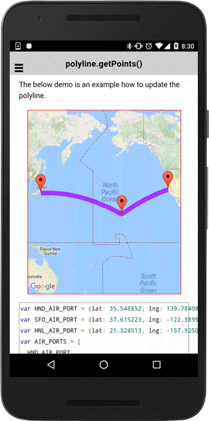

:warning: **This document is aim for older versions (from 2.0.0 to 2.2.9).
Document for new version is https://github.com/mapsplugin/cordova-plugin-googlemaps-doc/blob/master/v2.6.0/README.md**

# polyline.getPoints()

The getPoints() method returns an instance of [BaseArrayClass](../../BaseArrayClass/README.md).
You can modify the array instance using `insertAt()`, `setAt()`, and `removeAt()` methods.
The polyline is updated automatically.

The below demo is an example how to update the polyline.

```html
<div  id="map_canvas"></div>
```

```js
var HND_AIR_PORT = {lat: 35.548852, lng: 139.784086};
var SFO_AIR_PORT = {lat: 37.615223, lng: -122.389979};
var HNL_AIR_PORT = {lat: 21.324513, lng: -157.925074};
var AIR_PORTS = [
  HND_AIR_PORT,
  HNL_AIR_PORT,
  SFO_AIR_PORT
];

var mapDiv = document.getElementById("map_canvas");

// Create a map with specified camera bounds
var map = plugin.google.maps.Map.getMap(mapDiv, {
  camera: {
    target: AIR_PORTS
  }
});

map.addEventListener(plugin.google.maps.event.MAP_READY, function() {

  addEditablePolyline(map, AIR_PORTS, function(polyline) {

    // To do something...

  });

});

function addEditablePolyline(map, points, callback) {

  // Add a polyline
  map.addPolyline({
    'points': points,
    'color' : '#AA00FF',
    'width': 10,
    'geodesic': true
  }, function(polyline) {

    // polyline.getPoints() returns an instance of BaseArrayClass.
    var mvcArray = polyline.getPoints();

    // Add draggable markers
    mvcArray.mapAsync(function(latLng, cb) {
      map.addMarker({
        position: latLng,
        draggable: true
      }, cb);
    }, function(markers) {

      // If a marker is dragged, set the position of it to the points of the Polygon.
      markers.forEach(function(marker, idx) {
        marker.on(plugin.google.maps.event.MARKER_DRAG, function(position) {
          mvcArray.setAt(idx, position);
        });
      });

      callback(polygon);
    });
  });

}
```


