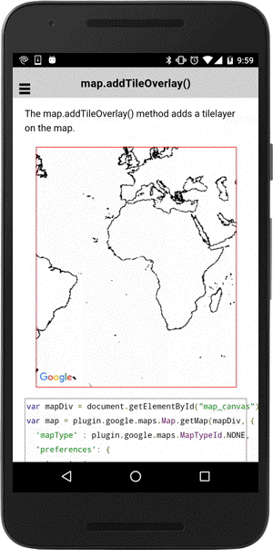

# map.addTileOverlay()

The map.addTileOverlay() method adds a tilelayer on the map.

```html
<div id="map_canvas"></div>
```

```js
var mapDiv = document.getElementById("map_canvas");
var map = plugin.google.maps.Map.getMap(mapDiv, {
  'mapType' : plugin.google.maps.MapTypeId.NONE,
  'preferences': {
    'zoom': {
      'minZoom': 0,
      'maxZoom': 4
    }
  }
});

map.addEventListener(plugin.google.maps.event.MAP_READY, function() {

  map.addTileOverlay({
    // Load image files from the local file path
    tileUrlFormat: "../images/map-for-free/&lt;zoom&gt;_&lt;x&gt;-&lt;y&gt;.gif"
  }, function(tileOverlay) {

  });

});
```


