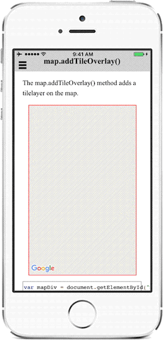

# map.addTileOverlay()

The map.addTileOverlay() method adds a tile layer on the map.

**Note**

The behaviors between Android and iOS are different.

While Android requests `the tile zoom level` **as the same as** `map camera`,
iOS requests `the zoom level of map camera **+ 1**` always.

The maps plugin just passes the parameters to the `getTile()` function.

**So this is NOT a bug (I guess Google's bug).**

In order to work both the same Android and iOS, detect the OS, and handle it.

Below code is a solution.

```html
<div id="map_canvas"></div>
```

```js
var mapDiv = document.getElementById("map_canvas");
var map = plugin.google.maps.Map.getMap(mapDiv, {
  //'mapType' : plugin.google.maps.MapTypeId.NONE,
  'preferences': {
    'zoom': {
      'minZoom': 0,
      'maxZoom': /Android/i.test(window.navigator.userAgent) ? 4 : 3
    }
  }
});

map.addEventListener(plugin.google.maps.event.MAP_READY, function() {

  map.addTileOverlay({
    debug: true,  // draw debug infomation on tiles

    opacity: 0.75,  // from 0.0 to 1.0

    // Load image files from the local file path
    getTile: function(x, y, zoom) {
      //return "http://tile.openstreetmap.org/" + zoom + "/" + x + "/" + y + ".png";
      return "../images/map-for-free/" + zoom + "_" + x + "-" + y + ".gif"
    }
  }, function(tileOverlay) {

  });

});
```

<table>
<tr>
  <td align="center"><strong>Android</strong><br></td>
  <td align="center"><strong>iOS</strong><br></td>
</tr>
</table>
