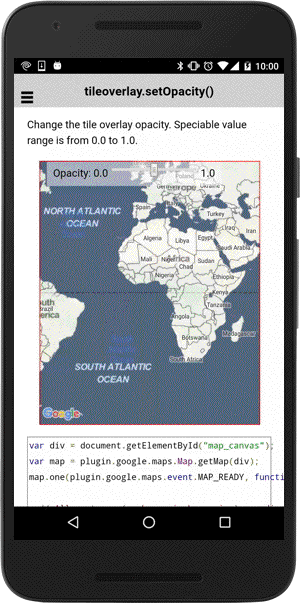

# tileOverlay.setOpacity()

Change the tile overlay opacity. Speciable value range is from 0.0 to 1.0.

```html
<div class="map" id="map_canvas">
  <span  class="smallPanel">
    Opacity: 0.0&nbsp;<input id="opacityRange" type="range" min="0" max="1" step="0.1">&nbsp;1.0
  </span>
</div>
```

```js
var div = document.getElementById("map_canvas");
var map = plugin.google.maps.Map.getMap(div);
map.one(plugin.google.maps.event.MAP_READY, function() {

  // All gestures (such as pinch-zooming) are disabled.
  map.setAllGesturesEnabled(false);

  // Add a tile overlay
  map.addTileOverlay({
    // &lt;x&gt;,&lt;y&gt; and &lt;zoom&gt; are replaced with values
    // (i.e. http://tile.stamen.com/toner/2/1/2.png)
    getTile: function(x, y, zoom) {
      return "http://tile.stamen.com/toner/" + zoom + "/" + x + "/" + y + ".png";
    }
  }, function(tileOverlay) {

    var range = document.getElementById("opacityRange");
    range.addEventListener("change", function() {

      // Set the current value as opacity.
      tileOverlay.setOpacity(this.value);
    });

    // Set the current value as opacity.
    tileOverlay.setOpacity(range.value);

  });

});
```


