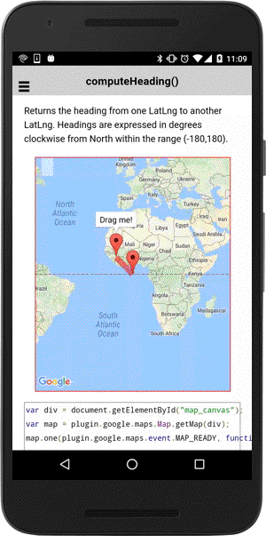

:warning: **This document is aim for older versions (from 2.0.0 to 2.2.9).
Document for new version is https://github.com/mapsplugin/cordova-plugin-googlemaps-doc/blob/master/v2.6.0/README.md**

# spherical.computeHeading()

Returns the heading from one [LatLng](../../../LatLng/README.md) to another [LatLng](../../../LatLng/README.md). Headings are expressed in degrees clockwise from North within the range (-180,180).

```html
<div class="map" id="map_canvas">
  <span  class="smallPanel" id="label"></span>
</div>
```

```js
var div = document.getElementById("map_canvas");
var map = plugin.google.maps.Map.getMap(div);
map.one(plugin.google.maps.event.MAP_READY, function() {

  createMarkers(map, [
    {"lat": 0, "lng": 0},
    {"lat": 10, "lng": -10}
  ], function(markers) {
    var basePosition = markers.getAt(0).getPosition();
    var draggableMarker = markers.getAt(1).setDraggable(true).setTitle("Drag me!").showInfoWindow();

    map.addPolyline({
      "points": markers
    }, function(polyline) {
      var points = polyline.getPoints();

      draggableMarker.on("position_changed", function(position) {
        points.setAt(1, position);

        // Calculate the heading
        var heading = plugin.google.maps.geometry.spherical.computeHeading(basePosition, position);
        label.innerText = "heading : " + heading.toFixed(0) + "&deg;";
      });
    });

  });
});
function createMarkers(map, positions, callback) {
  var markers = new plugin.google.maps.BaseArrayClass();
  markers.on("insert_at", function() {
    if (markers.getLength() === positions.length) {
      callback(markers);
    }
  });

  positions.forEach(function(position) {
    map.addMarker({
      position: position
    }, function(marker) {
      markers.push(marker);
    });
  })

}
```


