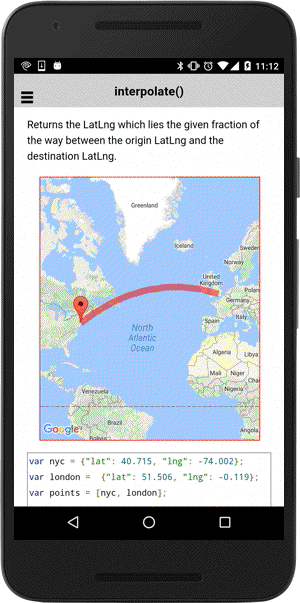

# spherical.interpolate()

Returns the LatLng which lies the given fraction of the way between the origin [LatLng](../../../LatLng/README.md) and the destination [LatLng](../../../LatLng/README.md).

```html
<div id="map_canvas"></div>
```

```js
var nyc = {"lat": 40.715, "lng": -74.002};
var london =  {"lat": 51.506, "lng": -0.119};
var points = [nyc, london];

var mapDiv = document.getElementById("map_canvas");
var map = plugin.google.maps.Map.getMap(mapDiv, {
  camera: {
    target: points,
    padding: 100
  }
});

map.addEventListener(plugin.google.maps.event.MAP_READY, function() {

    map.addPolyline({
      "points": points,
      "geodesic": true
    });

    map.addMarker({
      position: nyc
    }, function(marker) {
      var fraction = 0;
      var direction = 1;
      setInterval(function() {
        fraction += 0.01 * direction;
        if (fraction >= 1) {
          direction = -1;
        } else if (fraction <= 0) {
          direction = 1;
        }

        marker.setPosition(plugin.google.maps.geometry.spherical.interpolate(nyc, london, fraction));
      }, 50);

    })

});
```


