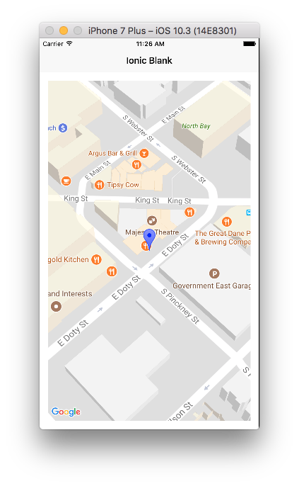

# Google Maps plugin of Ionic native 4.0

The Google Maps plugin of the Ionic native 4.0 uses the cordova-googlemaps-plugin v2.0,
Since the Google Maps plugin of the ionic native was written by Ionic team, code style is little different.
But the most of all methods are the same as the original version.

## The documentation

The ionic team creates a wrapper plugin of this plugin in order to use this plugin with typescript.
You can read documents at https://ionic-site-staging.herokuapp.com/docs/native/google-maps/

## Installation

### 1. Install the Cordova and Ionic Native plugins:

```
$ ionic cordova plugin add https://github.com/mapsplugin/cordova-plugin-googlemaps#multiple_maps --variable API_KEY_FOR_ANDROID="YOUR_ANDROID_API_KEY_IS_HERE" --variable API_KEY_FOR_IOS="YOUR_IOS_API_KEY_IS_HERE"

$ npm install --save @ionic-native/google-maps
```

### 2. [Add this plugin to your app's module](https://ionicframework.com/docs/native/#Add_Plugins_to_Your_App_Module)


## Supported platforms

- Android
- iOS

## Usage

Example code files: https://github.com/mapsplugin/ionic-google-maps

**pages/home/home.ts**

```TypeScript
import {
 GoogleMaps,
 GoogleMap,
 GoogleMapsEvent,
 GoogleMapOptions,
 CameraPosition,
 MarkerOptions,
 Marker
} from '@ionic-native/google-maps';
import { Component } from "@angular/core/";

import { Platform } from 'ionic-angular';
@Component({
  selector: 'page-home',
  templateUrl: 'home.html'
})
export class HomePage {
  map: GoogleMap;
  mapElement: HTMLElement;
  constructor(private googleMaps: GoogleMaps, public platform: Platform) {

    // Wait the native plugin is ready.
    platform.ready().then(() => {
      this.loadMap();
    });
  }

  // Don't use the ngAfterViewInit(). The native plugin is not ready.
  //ngAfterViewInit() {
  // this.loadMap();
  //}

 loadMap() {
    this.mapElement = document.getElementById('map');

    let mapOptions: GoogleMapOptions = {
      camera: {
        target: {
          lat: 43.0741904,
          lng: -89.3809802
        },
        zoom: 18,
        tilt: 30
      }
    };

    this.map = this.googleMaps.create(this.mapElement, mapOptions);

    // Wait the MAP_READY before using any methods.
    this.map.one(GoogleMapsEvent.MAP_READY)
      .then(() => {
        console.log('Map is ready!');

        // Now you can use all methods safely.
        this.map.addMarker({
            title: 'Ionic',
            icon: 'blue',
            animation: 'DROP',
            position: {
              lat: 43.0741904,
              lng: -89.3809802
            }
          })
          .then(marker => {
            marker.on(GoogleMapsEvent.MARKER_CLICK)
              .subscribe(() => {
                alert('clicked');
              });
          });

      });
  }
}
```

**pages/home/home.html**

```html
<ion-header>
  <ion-navbar>
    <ion-title>
      Ionic Blank
    </ion-title>
  </ion-navbar>
</ion-header>

<ion-content padding>
  <div #map id="map" style="height:100%;z-index: 1000;"></div>  
</ion-content>
```


