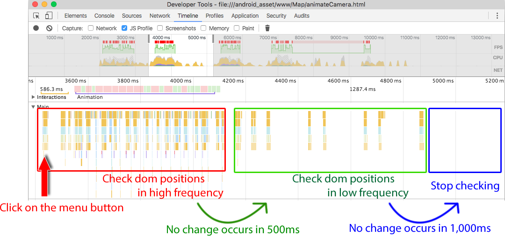
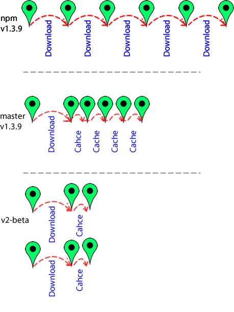
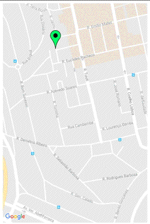
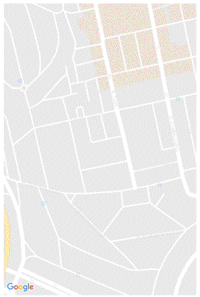
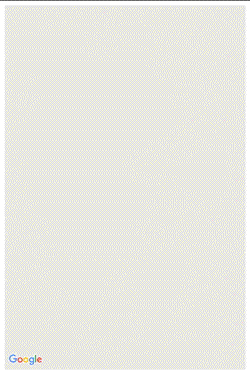

# What's new in cordova-google-maps-plugin Version 2?

Version 2 of the plugin has been improved a lot from version 1.

### change 1: Multiple maps

As you may know, the new version supports multiple maps in the same HTML page.
However one map takes up a large amount of memory, so I recommend a maximum of two or three maps on one page.
If you don't use a map then remove it - that will save memory.

### change 2: Multiple pages

Version 1.x only supported a single HTML file (typically index.html).
The new version supports multiple HTML file (such as index.html, page1.html, page2.html ...etc)
You don't need to clean up the maps if you change HTML files. The plugin will do that automatically.

However, changing tab page in the same HTML is different.
You still need to use `map.setVisible(true/false)`.

### change 3: Recognise all HTML elements

Version 1.x only supported the map div.
The new version recognises all the HTML elements on the page.
It means you don't need to execute `map.setClickable(true/false)` when a HTML dialog is popped up on the map div.

** Here is a tip **
If the plugin does not recognise your HTML elements on the map div, specify the following css:
```css
.dialog {
    position: fixed;
    z-index: 1000; //any value is fine
}
```

HTML elements that have `position:fixed` always take priority in the maps plugin.
(You don't need to do this usually (I believe))

### Change 4: Save battery life

The problem with version 1.x was the [KeepWatching Timer](https://github.com/mapsplugin/cordova-plugin-googlemaps/tree/caf6ec1099afc0c2993a367a346d44b6e5b0f99c/www/googlemaps-cdv-plugin.js#L2474).
This timer periodically watches HTML element positions in the map div.
However the timer runs continuously, regardless of whether there is user input in your app or not.
This affects your battery life.

In the new version, the timer stops automatically if the user does not touch on the map for a while.
If the user touches on the app again then the timer starts.
If there are no changes for a while then the timer stops again.



If you need to start the timer programmatically, you can do so like this:
```js
cordova.fireDocumentEvent('plugin_touch', {});

or

var event = document.createEvent('plugin_touch');
event.initEvent(eventName, false, false);
document.dispatchEvent(event);
```

**NOTE: The plugin V2 now uses `plugin_touch` instead of `touch_start`**

### Change 5. Performance improvements

Another big problem of version 1.x was that all (most) native code ran on the UI thread (or ran on the WebCore thread).
The reason for this is the Google Maps native APIs require it.
However I tested so much time and rewrote almost the entire codebase in both native and Javascript, so most of the code runs on the background thread. And most of the code now runs in parallel.

For example, adding multiple markers on a map works like this.



In the end, adding multiple markers becomes a lot faster.

<table>
<tr>
<td><a href="https://github.com/mapsplugin/cordova-plugin-googlemaps/tree/1.3.9">npm version1.3.9</a></td>
<td><a href="https://github.com/mapsplugin/cordova-plugin-googlemaps/tree/caf6ec1099afc0c2993a367a346d44b6e5b0f99c">v1.3.9 Master branch / commit caf6ec1099</a></td>
<td><a href="https://github.com/mapsplugin/cordova-plugin-googlemaps/commit/906fc049d62b3f1cc8b6bab0dbcff5b1113b907d">v2-beta / commit 906fc04</a></td>
</tr>

<tr>
<td><br><b>47.1 sec</b></td>
<td><br><b>1.0 sec</b></td>
<td><br><b>0.5 sec</b>
</td>
</tr>
</table>

See more information at [issue #835: Performance problems when adding many markers](https://github.com/mapsplugin/cordova-plugin-googlemaps/issues/835#issuecomment-251778071)

If you don't understand this you can skip it. Just remember that the performance has been improved.

### change 6. Split JS files

The version 1.x code of the Javascript is [googlemaps-cdv-plugin.js](https://github.com/mapsplugin/cordova-plugin-googlemaps/tree/caf6ec1099afc0c2993a367a346d44b6e5b0f99c/www/googlemaps-cdv-plugin.js)
The file is 2873 lines long. Wow, it's too large and not suitable for maintenance...not even for me!

I have split the JS files for each class (such as Marker.js, Circle.js, etc):
https://github.com/mapsplugin/cordova-plugin-googlemaps/tree/multiple_maps/www

You can now debug easily :)

### change 7. Introduce BaseArrayClass

If you are familiar with the Google Maps Javascript API v3, you probably know the [MVCArray class](https://developers.google.com/maps/documentation/javascript/3.exp/reference#MVCArray)
The benefit of this class is you can monitor the events: `insert_at`, `set_at`, and `remove_at`.
Using this class your code will be simpler.

### change 8. Property synchronizing

This is really useful. Most `getXXXX()` methods return the values as a normal Javascript object.

For example, in version 1.x:
```js
marker.getPosition(function(position) {
   // you have to wait for the callback
});
```

in version 2.0-beta:
```js
var position = marker.getPosition();
```

You know what? Since the marker (and polyline,polygon...etc) extends the BaseClass (which is MVC class), you can monitor like this:

```js
markers[0].on("position_changed", onPositionChanged);
markers[1].on("position_changed", onPositionChanged);
markers[2].on("position_changed", onPositionChanged);

function onPositionChanged() {
  var marker = this;
  var position = marker.getPosition();
}
```

However, `map.getVisibleRegion()` does not support this, you still have to use a callback.

### change 9. Chain programming

In version 2.0, most `setXXX()` methods are able to chain.

```js
marker.setPosition({"lat": ...., "lng": ....}).setTitle("Hello");
```

### change 10. Add more events, and renamed:

#### Version 1.x events
<table>
<tr><th>event name</th>
<th>Androide</th>
<th>iOS</th>
</tr>
<tr><td> MAP_CLICK </td><td> YES </td><td> YES </td></tr>
<tr><td> MAP_LONG_CLICK </td><td> YES </td><td> YES </td></tr>
<tr><td> MY_LOCATION_CHANGE </td><td> YES </td><td> NO </td></tr>
<tr><td> MY_LOCATION_BUTTON_CLICK </td><td> YES </td><td> YES </td></tr>
<tr><td> INDOOR_BUILDING_FOCUSED </td><td> YES </td><td> YES </td></tr>
<tr><td> INDOOR_LEVEL_ACTIVATED </td><td> YES </td><td> YES </td></tr>
<tr><td> CAMERA_CHANGE </td><td> YES </td><td> YES </td></tr>
<tr><td> CAMERA_IDLE </td><td> NO </td><td> YES </td></tr>
<tr><td> MAP_READY </td><td> YES </td><td> YES </td></tr>
<tr><td> MAP_LOADED </td><td> YES </td><td> NO </td></tr>
<tr><td> MAP_WILL_MOVE </td><td> NO </td><td> YES </td></tr>
<tr><td> MAP_CLOSE </td><td> YES </td><td> YES </td></tr>
<tr><td> OVERLAY_CLICK </td><td> YES </td><td> YES </td></tr>
<tr><td> INFO_CLICK </td><td> YES </td><td> YES </td></tr>
<tr><td> MARKER_DRAG </td><td> YES </td><td> YES </td></tr>
<tr><td> MARKER_DRAG_START </td><td> YES </td><td> YES </td></tr>
<tr><td> MARKER_DRAG_END </td><td> YES </td><td> YES </td></tr>
</table>

#### Version 2.x events
<table>
<tr><th>event name</th>
<th>Androide</th>
<th>iOS</th>
<th>arguments[0]</th>
</tr>
<tr><td> MAP_READY </td><td> YES </td><td> YES </td><td> none </td></tr>
<tr><td> MAP_CLICK </td><td> YES </td><td> YES </td><td>  LatLng </td></tr>
<tr><td> MAP_LONG_CLICK </td><td> YES </td><td> YES </td><td>  LatLng </td></tr>
<tr><td> MY_LOCATION_BUTTON_CLICK </td><td> YES </td><td> YES </td><td> none </td></tr>
<tr><td> INDOOR_BUILDING_FOCUSED </td><td> YES </td><td> YES </td><td> none </td></tr>
<tr><td> INDOOR_LEVEL_ACTIVATED </td><td> YES </td><td> YES </td><td>  building information </td></tr>
<tr><td> CAMERA_MOVE_START </td><td> YES </td><td> YES </td><td> true if the camera move start by gesture </td></tr>
<tr><td> CAMERA_MOVE </td><td> YES </td><td> YES </td><td>  CameraPosition </td></tr>
<tr><td> CAMERA_MOVE_END </td><td> YES </td><td> YES </td><td>  CameraPosition </td></tr>
<tr><td> POLYGON_CLICK </td><td> YES </td><td> YES </td><td> LatLng(clicked position) </td></tr>
<tr><td> POLYLINE_CLICK </td><td> YES </td><td> YES </td><td> LatLng(clicked position) </td></tr>
<tr><td> CIRCLE_CLICK </td><td> YES </td><td> YES </td><td> LatLng(clicked position) </td></tr>
<tr><td> GROUND_OVERLAY_CLICK </td><td> YES </td><td> YES </td><td> LatLng(clicked position) </td></tr>
<tr><td> INFO_CLICK </td><td> YES </td><td> YES </td><td> LatLng(marker position) </td></tr>
<tr><td> INFO_LONG_CLICK </td><td> YES </td><td> YES </td><td> LatLng(marker position) </td></tr>
<tr><td> INFO_CLOSE </td><td> YES </td><td> YES </td><td> LatLng(marker position) </td></tr>
<tr><td> INFO_OPEN </td><td> YES </td><td> YES </td><td> LatLng(marker position) </td></tr>
<tr><td> MARKER_CLICK </td><td> YES </td><td> YES </td><td> LatLng(marker position) </td></tr>
<tr><td> MARKER_DRAG </td><td> YES </td><td> YES </td><td> LatLng(marker position) </td></tr>
<tr><td> MARKER_DRAG_START </td><td> YES </td><td> YES </td><td> LatLng(marker position) </td></tr>
<tr><td> MARKER_DRAG_END </td><td> YES </td><td> YES </td><td> LatLng(marker position) </td></tr>
</table>

### change 11. Set background color

Use `plugin.google.maps.environment.setBackgroundColor()`

### change 12. Geocoding/reverse geocoding

You can do Geocoding like this:

```js
plugin.google.maps.Geocoder.geocode({
  "address" : [
     "address1", "address2" ... "addressN"
  ]
}, function( mvcArray ) {

  mvcArray.on('insert_at', function(index) {
     console.log( mvcArray.getAt(index) );
  });

});
```

### change 13. Add some features

I forgot too much. See the demo APK.


### change 14. Not yet

`map.showDialog()`, `map.closeDialog()`, and `map.addKmlOverlay()` are not ready yet.


### change 15. UIWebView & WKWebView

Both are Supported.

Crosswalk is not confirmed yet.

I think I may have missed something. I will post if I remember.
