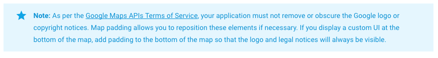

# Terms of Services of Google Maps APIs

You need to follow the [Google Maps API Terms of Service](https://developers.google.com/maps/terms)

https://developers.google.com/maps/terms

Additionally, you **MUST** include the license attribution text as part of a **"Legal Notices"** section in your application. Including legal notices as an independent menu item, or as part of an "About" menu item, is recommended.

This is required by
- [Google Maps SDK for iOS](https://developers.google.com/maps/documentation/ios/intro#attribution_requirements)

The strings of the terms of services is able to obtain using [`map.getLicenseInfo()`](../class/Map/getLicenseInfo/README.md)

https://github.com/mapsplugin/cordova-plugin-googlemaps-doc/tree/master/v2.0.0/class/Map/getLicenseInfo/README.md

