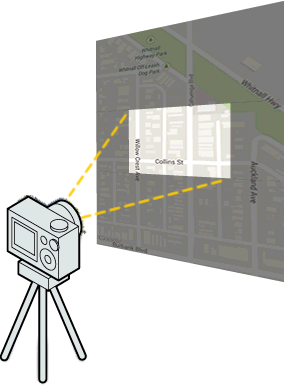
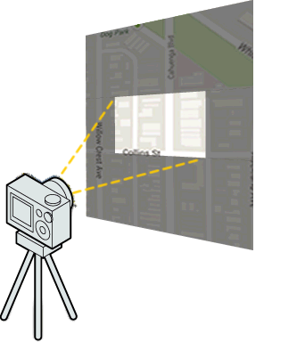

:warning: **This document is aim for older versions (from 2.3.0 to 2.5.3).
Document for new version is https://github.com/mapsplugin/cordova-plugin-googlemaps-doc/blob/master/v2.6.0/README.md**

# CameraPosition object

## properties

<table>
  <tr>
    <th>Property</th>
    <th>Type</th>
    <th>Description</th>
  </tr>
  <tr>
    <td>target</td>
    <td>
      ILatLng, 
       
      Array.&lt;ILatLng&gt;
    </td>
    <td>
      The center location of the camera view.
       
      
  </tr>
  <tr>
    <td>tilt</td>
    <td>number</td>
    <td>
      View angle
       
      
    </td>
  </tr>
  <tr>
    <td>zoom</td>
    <td>number</td>
    <td>
      Zoom level
       
      
    </td>
  </tr>
  <tr>
    <td>bearing</td>
    <td>number</td>
    <td>
      Map orientation
       
      
    </td>
  </tr>
  <tr>
    <td>duration</td>
    <td>number</td>
    <td>The duration of animation in milliseconds.</td>
  </tr>
</table>
