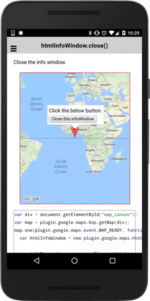

# htmlInfoWindow.close()

Close the htmlInfoWindow.

```html
<div id="map_canvas"></div>
```

```js
var div = document.getElementById("map_canvas");
var map = plugin.google.maps.Map.getMap(div);
map.one(plugin.google.maps.event.MAP_READY, function() {
  var htmlInfoWindow = new plugin.google.maps.HtmlInfoWindow();

  var infoDiv = document.createElement("div");
  infoDiv.innerHTML = "Click the below button.&lt;br&gt;";

  var button = document.createElement("button");
  button.innerText = "Close this infoWindow";
  button.addEventListener("click", function() {
    htmlInfoWindow.close();
  });
  infoDiv.appendChild(button);

  htmlInfoWindow.setContent(infoDiv);

  map.addMarker({
    position: {lat: 0, lng: 0}
  }, function(marker) {

    marker.on(plugin.google.maps.event.MARKER_CLICK, function() {
      htmlInfoWindow.open(marker);
    });
    marker.trigger(plugin.google.maps.event.MARKER_CLICK);

  });
});
```


