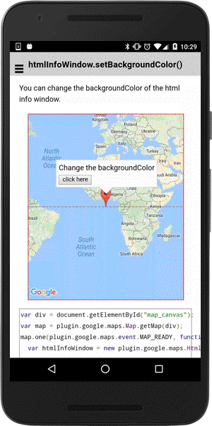

:warning: **This document is aim for older versions (from 2.3.0 to 2.5.3).
Document for new version is https://github.com/mapsplugin/cordova-plugin-googlemaps-doc/blob/master/v2.6.0/README.md**

# htmlInfoWindow.setBackgroundColor()

You can change the background color of HtmlInfoWindow.

```
htmlInfoWindow.setBackgroundColor(color);
```


## Parameters

name           | type          | description
---------------|---------------|---------------------------------------
color          | String        | HTML color strings
-----------------------------------------------------------------------


## Demo code

```html
<div id="map_canvas"></div>
```

```js
var div = document.getElementById("map_canvas");
var map = plugin.google.maps.Map.getMap(div);

var htmlInfoWindow = new plugin.google.maps.HtmlInfoWindow();

var contents = document.createElement("div");
contents.appendChild(document.createTextNode("Change the backgroundColor"));
contents.appendChild(document.createElement("br"));

var button = document.createElement("button");
button.appendChild(document.createTextNode("click here"));
contents.appendChild(button);
button.addEventListener("click", function() {
  htmlInfoWindow.setBackgroundColor("#aaaaff");
});
htmlInfoWindow.setContent(contents);

var marker = map.addMarker({
  position: {lat: 0, lng: 0},
  draggable: true
});

marker.on(plugin.google.maps.event.MARKER_CLICK, function() {
  htmlInfoWindow.open(marker);
});

marker.trigger(plugin.google.maps.event.MARKER_CLICK);
```


