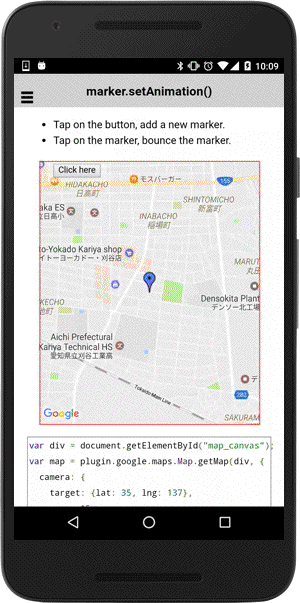

# Marker class

_This class extends [BaseClass](../BaseClass/README.md)_.

## Contents

  - <a href="#overview">Overview</a>
    - <a href="#create-a-marker">Create a marker</a>
    - <a href="#create-multiple-marker">Create multiple marker</a>
    - <a href="#marker-class-extends-baseclass">Marker class extends BaseClass</a>
    - <a href="#icon">Icon</a>
    - <a href="#drag">Drag</a>
    - <a href="#marker-animation">Marker Animation</a>
    - <a href="#disable-auto-pan">Disable auto pan</a>
  - <a href="#api-reference">API Reference</a>

------------

## Overview


### Create a marker

The **map.addMarker()** method adds a marker onto the map.

- _This method works **after the MAP_READY event**._

```js
const GOOGLE = {"lat": 37.422476, "lng": -122.08425};

document.addEventListener("deviceready", function() {
  // Define a div tag with id="map_canvas"
  var mapDiv = document.getElementById("map_canvas");

  // Initialize the map plugin
  var map = plugin.google.maps.Map.getMap(mapDiv, {
    'camera': {
      'latLng': GOOGLE,
      'zoom': 17
    }
  });

  // You have to wait the MAP_READY event.
  map.one(plugin.google.maps.event.MAP_READY, onMapInit);
});

function onMapInit(map) {

  // Add a marker
  map.addMarker({
    'position': GOOGLE,
    'title': "Hello GoogleMap for Cordova!"
  }, function(marker) {

    // Show the infoWindow
    marker.showInfoWindow();

  });
}
```


------------

### Create multiple marker

If you want to create multiple marker, using  [BaseArrayClass](../BaseArrayClass/README.md) would be better solution.

```js
var data = [
  {
    position: {lng: -122.1180187, lat: 37.3960513},
    title: "Ardis G Egan Intermediate School"
  },
  {
    position: {lng: -122.1102408, lat: 37.3943847},
    title: "Portola School"
  },
  {
    position: {lng: -122.0848257, lat: 37.3818032},
    title: "Isaac Newton Graham Middle School"
  },
  {
    position: {lng: -122.1082962, lat: 37.3863294},
    title: "Los Altos High School"
  },
  {
    position: {lng: -122.013571, lat: 37.3874409},
    title: "The Kings Academy"
  },
  {
    position: {lng: -122.082462, lat: 37.3627189},
    title: "Georgina P Blach Intermediate School"
  },
  {
    position: {lng: -122.0421832, lat: 37.3766077},
    title: "Benner Junior High School"
  }
];

// Add markers
var baseArrayClass = new plugin.google.maps.BaseArrayClass(data);

baseArrayClass.map(function(options, cb) {
  // The variable "options" contains each element of the data.
  //
  // The variable "cb" is a callback function of iteration.
  map.addMarker(options, cb);

}, function(markers) {

  // Set a camera position that includes all markers.
  var bounds = [];
  data.forEach(function(POI) {
    bounds.push(POI.position);
  });

  map.moveCamera({
    target: bounds
  }, function() {

    // After camera moves open the last marker.
    markers[markers.length - 1].showInfoWindow();
  });

});
```


------------

### Marker class extends BaseClass

#### Add your data, and hold them

Since Marker class extends [BaseClass](../BaseClass/README.md), you can set your custom values.
Of course, listening the `(key)_changed` event is as well.

```js
map.addMarker({
  position: { lat: 43.0741704, lng: -89.3809802},
  count: 0
}, function(marker) {

  marker.on(plugin.google.maps.event.MARKER_CLICK, function() {
    marker.set("count", marker.get("count") + 1);
  });


  marker.on("count_changed", function(oldValue, newValue, key) {
    marker.setTitle("'" + key + "' is changed from '" +
                  oldValue + "' to '" + newValue + "'");
  });

});
```


#### bindTo() method

`bindTo()` method is useful when you manipulate multiple overlays with the same value.

```js
map.addMarker({
  position: {lat: 43.0741704, lng: -89.3809802},
  draggable: true
}, function(marker) {

  map.addCircle({
    center: marker.getPosition(),
    radius: 10,
    fillColor: "rgba(0, 0, 255, 0.5)",
    strokeColor: "rgba(0, 0, 255, 0.75)",
    strokeWidth: 1
  }, function(circle) {

    // circle.center = marker.position
    marker.bindTo("position", circle, "center");
  });

});
```


------------

### Icon

#### SimpleIcon

You can use one of the following protocol: `https`, `file`, `cdvfile` and `file absolute path`.

```
map.addMarker({
  'position': GOOGLE_TOKYO,
  'title': 'Google Tokyo!',
  'icon': {
    'url': 'images/google_tokyo_icon.png'
   }
});
```


#### Color Icon

You can specify [HTML color](./Available-HTML-colors) as icon.
The alpha value is ignored.

**black and white is not available for Android, because the native api accepts color as hue. This is not a bug, specification. Please read [How to set the marker color to black in google maps android(Stack Overflow)](http://stackoverflow.com/questions/28501998/how-to-set-the-marker-color-to-black-in-google-maps-android/28503769#28503769
)**
```js
map.addMarker({
  position: {"lat": 0, "lng": 0},
  icon: 'blue',
  'title': "Hello World!\nThis plugin is very awesome!",
  'snippet': "Tap here!"
}, function( marker ) {
  marker.showInfoWindow();
});
```


#### Base64 Encoded Icon

The marker's icon and title properties accept base64 encoded image strings.
You can generate the base64 encoded strings using HTML5's Canvas object.
This means you are able to create marker image programmatically.
```js
var icon = "data:image/png;base64,iVBORw0KGgo...CC";
var canvas = document.createElement('canvas');
canvas.width = 120;
canvas.height = 40;
var context = canvas.getContext('2d');

var img = new Image();
img.src = "./images/google_logo.gif";
img.onload = function() {
  context.drawImage(img, 0, 0);

  context.font = '15pt Calibri';
  context.fillStyle = 'blue';
  context.fillText('Google', 40, 15);
  context.fillText('Tokyo!', 60, 35);

  map.addMarker({
    'position': latLng,
    'title': canvas.toDataURL(),
    'icon': icon
  }, function(marker) {
    marker.showInfoWindow();
  });
};
map.addMarker({
  'position': latLng,
  'title': canvas.toDataURL(),
  'icon': icon
}, function(marker) {
  marker.showInfoWindow();
});
```

------------

### Drag

Simply just set `draggable: true`.

```js
map.addMarker({
  'position': GOOGLE,
  'draggable': true
}, function(marker) {

  marker.addEventListener(plugin.google.maps.event.MARKER_DRAG_END, function(position) {
    marker.setTitle(position.toUrlValue());
    marker.showInfoWindow();
  });

});
```


------------

### Marker Animation

You can specify animation for marker.

Available values:
- plugin.google.maps.Animation.DROP (*Although the DROP animation bounces in iOS, Android does not bounce.*)
- plugin.google.maps.Animation.BOUNCE

```js
map.addMarker({
  position: new plugin.google.maps.LatLng(35, 137),
  icon: "http://www.google.com/intl/en_us/mapfiles/ms/icons/blue-dot.png",
  animation: plugin.google.maps.Animation.DROP
}, function(marker) {

  var button = div.getElementsByTagName('button')[0];
  button.addEventListener("click", function() {
    marker.setAnimation(plugin.google.maps.Animation.DROP);
  });

  marker.on(plugin.google.maps.event.MARKER_CLICK, function() {
    marker.setAnimation(plugin.google.maps.Animation.BOUNCE);
  });
});
```



------------

### Disable auto pan

You can disable auto panning when the marker is clicked.

```js
// Add a marker
map.addMarker({
  'position': {
    lat: 20,
    lng: 20
  },
  'animation': plugin.google.maps.Animation.BOUNCE,
  'title': 'The map does not move when you click on this marker.'
}, function(marker) {

  // Disable marker auto panning.
  marker.setDisableAutoPan(true);

  marker.on(plugin.google.maps.event.MARKER_CLICK, function() {
    marker.showInfoWindow();
  });

});
```


------------
## API reference

### Create

<table>
    <tr>
        <th><a href="./addMarker/README.md">map.addMarker()</a></th>
        <td>Add a marker.</td>
    </tr>
</table>


### Methods

<table>
    <tr>
        <th><a href="./getPosition/README.md">getPosition()</a></th>
        <td>Returns the marker position.</td>
    </tr>
    <tr>
        <th><a href="./showInfoWindow/README.md">showInfoWindow()</a></th>
        <td>Shows the infoWindow of the marker.</td>
    </tr>
    <tr>
        <th><a href="./hideInfoWindow/README.md">hideInfoWindow()</a></th>
        <td>Hides the infoWindow of the marker.</td>
    </tr>
    <tr>
        <th><a href="./setAnimation/README.md">setAnimation()</a></th>
        <td>Specifies a marker animation.</td>
    </tr>
    <tr>
        <th><a href="./isVisible/README.md">isVisible()</a></th>
        <td>Return true if the marker is visible.</td>
    </tr>
    <tr>
        <th>getTitle()</th>
        <td>Returns the marker title.</td>
    </tr>
    <tr>
        <th><a href="./setTitle/README.md">setTitle()</a></th>
        <td>Changes the marker title.</td>
    </tr>
    <tr>
        <th>getSnippet()</th>
        <td>Returns the marker snippet.</td>
    </tr>
    <tr>
        <th><a href="./setSnippet/README.md">setSnippet()</a></th>
        <td>Changes the marker snippet.</td>
    </tr>
    <tr>
        <th><a href="./remove/README.md">remove()</a></th>
        <td>Remove the marker.</td>
    </tr>
    <tr>
        <th><a href="./setIconAnchor/README.md">setIconAnchor()</a></th>
        <td>Sets the marker icon anchor.</td>
    </tr>
    <tr>
        <th><a href="./setInfoWindowAnchor/README.md">setInfoWindowAnchor()</a></th>
        <td>Changes the info window anchor. </td>
    </tr>
    <tr>
        <th><a href="./isInfoWindowShown/README.md">isInfoWindowShown()</a></th>
        <td>Return true if the infoWindow is shown on the marker.</td>
    </tr>
    <tr>
        <th><a href="./setOpacity/README.md">setOpacity()</a></th>
        <td>Changes the marker opacity.</td>
    </tr>
    <tr>
        <th>getOpacity()</th>
        <td>Returns the marker opacity.</td>
    </tr>
    <tr>
        <th><a href="./setZIndex/README.md">setZIndex()</a></th>
        <td>Changes the marker zIndex.</td>
    </tr>
    <tr>
        <th><a href="./setVisible/README.md">setVisible()</a></th>
        <td>Changes the marker visibility.</td>
    </tr>
    <tr>
        <th><a href="./setDraggable/README.md">setDraggable()</a></th>
        <td>Sets true if you allows all users to drag the marker.</td>
    </tr>
    <tr>
        <th>isDraggable()</th>
        <td>Returns true when the marker is draggable.</td>
    </tr>
    <tr>
        <th><a href="./setDisableAutoPan/README.md">setDisableAutoPan()</a></th>
        <td>Sets true if you **do not want** to move the map when you click on the marker.</td>
    </tr>
    <tr>
        <th><a href="./setPosition/README.md">setPosition()</a></th>
        <td>Sets the marker position.</td>
    </tr>
    <tr>
        <th><a href="./setRotation/README.md">setRotation()</a></th>
        <td>Sets the marker rotation angle.</td>
    </tr>
    <tr>
        <th>getRotation()</th>
        <td>Returns the marker rotation angle.</td>
    </tr>
    <tr>
        <th><a href="./setFlat/README.md">setFlat()</a></th>
        <td>Sets true if you want to be flat marker.</td>
    </tr>
    <tr>
        <th><a href="./setIcon/README.md">setIcon()</a></th>
        <td>Changes the marker icon.</td>
    </tr>
    <tr>
        <th>getMap()</th>
        <td>Return the map reference.</td>
    </tr>
</table>


### Events

<table>
    <tr>
        <th>MARKER_CLICK</th>
        <td>Arguments:  <a href="../LatLng/README.md">LatLng</a><br>This event is fired when you click on a marker.</td>
    </tr>
    <tr>
        <th>MARKER_DRAG_START</a>
        </th>
        <td>Arguments:  <a href="../LatLng/README.md">LatLng</a><br>This event is fired when you start dragging with a marker.</td>
    </tr>
    <tr>
        <th>MARKER_DRAG</th>
        <td>Arguments:  <a href="../LatLng/README.md">LatLng</a><br>This event is fired during marker dragging.</td>
    </tr>
    <tr>
        <th>MARKER_DRAG_END</th>
        <td>Arguments:  <a href="../LatLng/README.md">LatLng</a><br>This event is fired when you drop the marker.</td>
    </tr>
    <tr>
        <th>INFO_OPEN</th>
        <td>Arguments:  <a href="../LatLng/README.md">LatLng</a><br>This event is fired when the infoWindow is opened.</td>
    </tr>
    <tr>
        <th>INFO_CLICK</th>
        <td>Arguments:  <a href="../LatLng/README.md">LatLng</a><br>This event is fired when you click on the infoWindow.</td>
    </tr>
    <tr>
        <th>INFO_LONG_CLICK</th>
        <td>Arguments:  <a href="../LatLng/README.md">LatLng</a><br>This event is fired when you click longer on the infoWindow.</td>
    </tr>
    <tr>
        <th>INFO_CLOSE</th>
        <td>Arguments:  <a href="../LatLng/README.md">LatLng</a><br>This event is fired when the infoWindow is closed.</td>
    </tr>
</table>
