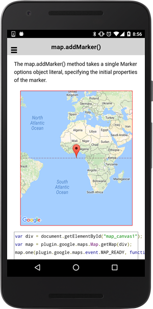
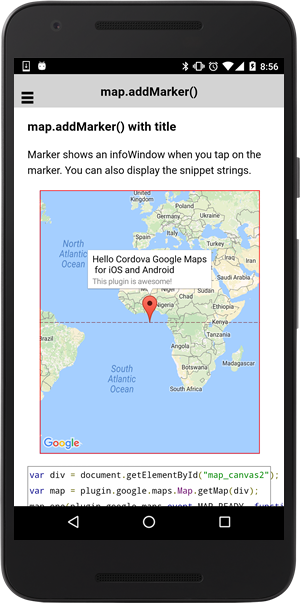

# map.addMarker()

The map.addMarker() method takes a single Marker options object literal, specifying the initial properties of the marker.

## Add a marker

```
(from v2.3.0 to current)
var marker = map.addMarker(options)

(from v2.0.0 to current)
map.addMarker(options, callback);
```


## Options

<table>
<tr>
  <th>Params</th>
  <th>Type</th>
  <th>Details</th>
</tr>
<tr>
  <td>position</td>
  <td>ILatLng</td>
  <td>marker position</td>
</tr>
<tr>
  <td>icon</td>
  <td>string | <a href="../markericon/README.md">MarkerIcon</a></td>
  <td>(optional)The icon image url or properties. Also you can specify HTML Color values. Alternatively you can specify the image as Base64. Please check out the <a href="../markericon/README.md">MarkerIcon</a> page.</td>
</tr>
<tr>
  <td>title</td>
  <td>string</td>
  <td>(optional)The content of the infoWindow. If you use HtmlInfoWindow, you can not set this property.</td>
</tr>
<tr>
  <td>snippet</td>
  <td>string</td>
  <td>(optional)The snippet of the infoWindow. If you use HtmlInfoWindow, you can not set this property.</td>
</tr>
<tr>
  <td>infoWindowAnchor</td>
  <td>Array&lt;x, y&gt;</td>
  <td>(optional)Specify the anchor of the InfoWindow in pixels</td>
</tr>
<tr>
  <td>anchor</td>
  <td>Array&lt;x, y&gt;</td>
  <td>(optional)Specify the anchor of icon image in pixels</td>
</tr>
<tr>
  <td>draggable</td>
  <td>boolean</td>
  <td>(optional)Set true if you want to enable to drag the marker. (Default: false) Important! Drag starts after long pressed on the marker.</td>
</tr>
<tr>
  <td>flat</td>
  <td>boolean</td>
  <td>(optional)Set true if you want to use a flat marker. (Default: false)</td>
</tr>
<tr>
  <td>rotation</td>
  <td>number</td>
  <td>(optional)Set rotation angle. (Default: 0)</td>
</tr>
<tr>
  <td>visible</td>
  <td>boolean</td>
  <td>(optional)Set false if you want to hide. (Default: true)</td>
</tr>
<tr>
  <td>styles</td>
  <td>{<br>
'text-align': (left, center, right),<br>
'font-style': (normal, italic),<br>
'font-weight': (normal, bold),<br>
'color': (red, #ccffcc, rgb(90, 32 100), etc)<br>
}</td>
  <td>(optional)Specify the options for title. This property work for normal InfoWindow.</td>
</tr>
<tr>
  <td>animation</td>
  <td>string</td>
  <td>(optional)Which animation to play when marker is added to a map.</td>
</tr>
<tr>
  <td>zIndex</td>
  <td>number</td>
  <td>(optional)Higher zIndex value overlays will be drawn on top of lower zIndex value tile layers and overlays.</td>
</tr>
<tr>
  <td>disableAutoPan</td>
  <td>boolean</td>
  <td>(optional)Set to true to disable auto panning when the marker is clicked.</td>
</tr>
</table>

------------------------------------------------------------------------------------------

## Demo code

```html
<div class="map" id="map_canvas1"></div>
```

```js
var div = document.getElementById("map_canvas1");
var map = plugin.google.maps.Map.getMap(div);

map.addMarker({
  'position': {
    lat: 0,
    lng: 0
  }
});
```



----------------------------------------

## Set title & snippet

Marker shows an infoWindow when you tap on the marker. You can also display the snippet strings.

```html
<div class="map" id="map_canvas2"></div>
```

```js
var div = document.getElementById("map_canvas2");
var map = plugin.google.maps.Map.getMap(div);

map.addMarker({
  'position': {
    lat: 0,
    lng: 0
  },
  title: "Hello Cordova Google Maps\n for iOS and Android",
  snippet: "This plugin is awesome!"
});

// Display the infoWindow
marker.showInfoWindow();
```



----------------------------------------

## Adding multiple markers

You can create multiple markers with simple code.

```html
<div class="map" id="map_canvas3"></div>
```

```js
var div = document.getElementById("map_canvas3");
var map = plugin.google.maps.Map.getMap(div);

var data = [
  {
    position: {lng: -122.1180187, lat: 37.3960513},
    title: "Ardis G Egan Intermediate School"
  },
  {
    position: {lng: -122.1102408, lat: 37.3943847},
    title: "Portola School"
  },
  {
    position: {lng: -122.0848257, lat: 37.3818032},
    title: "Isaac Newton Graham Middle School"
  },
  {
    position: {lng: -122.1082962, lat: 37.3863294},
    title: "Los Altos High School"
  },
  {
    position: {lng: -122.013571, lat: 37.3874409},
    title: "The Kings Academy"
  },
  {
    position: {lng: -122.082462, lat: 37.3627189},
    title: "Georgina P Blach Intermediate School"
  },
  {
    position: {lng: -122.0421832, lat: 37.3766077},
    title: "Benner Junior High School"
  }
];

// Add markers
var bounds = [];
var markers = data.map(function(options) {
  bounds.push(POI.position);
  return map.addMarker(options);
});

// Set a camera position that includes all markers.
map.moveCamera({
  target: bounds
}, function() {

  // After camera moves open the last marker.
  markers[markers.length - 1].showInfoWindow();

});
```


