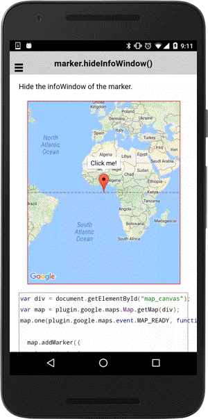

:warning: **This document is aim for older versions (from 2.3.0 to 2.5.3).
Document for new version is https://github.com/mapsplugin/cordova-plugin-googlemaps-doc/blob/master/v2.6.0/README.md**

# marker.hideInfoWindow()

Hide the infoWindow of the marker.

-----------------------------------------------------------------------

## Demo code

```html
<div id="map_canvas"></div>
```

```js
var div = document.getElementById("map_canvas");
var map = plugin.google.maps.Map.getMap(div);

var marker = map.addMarker({
  'position': {
    lat: 0,
    lng: 0
  },
  'title': "Click me!"
});

// Show the infoWindow
marker.showInfoWindow();

// Catch the MARKER_CLICK event
marker.on(plugin.google.maps.event.INFO_CLICK, function() {

  // Hide the infoWindow
  marker.hideInfoWindow();

});
```


