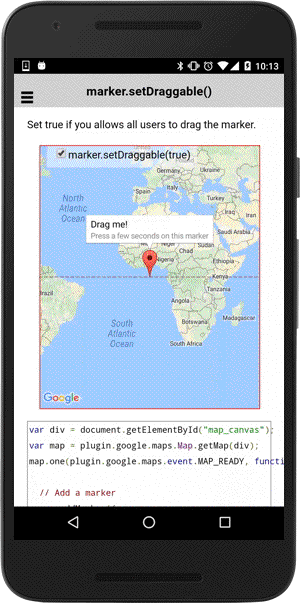

:warning: **This document is aim for older versions (from 2.3.0 to 2.5.3).
Document for new version is https://github.com/mapsplugin/cordova-plugin-googlemaps-doc/blob/master/v2.6.0/README.md**

# marker.setDraggable()

Set true if you allows all users to drag the marker.

```
marker.setDraggable(flag);
```

## Parameters

name           | type          | description
---------------|---------------|---------------------------------------
flag           | boolean       | `true`: draggable, `false`: not draggable(default)
-----------------------------------------------------------------------

## Demo code

```html
<div id="map_canvas">
    <span class="smallPanel"><input type="checkbox" id="toggleCheckbox" checked="checked">marker.setDraggable(true)</span>
</div>
```

```js
var div = document.getElementById("map_canvas");
var map = plugin.google.maps.Map.getMap(div);

// Add a marker
var marker = map.addMarker({
  'position': {
    lat: 0,
    lng: 0
  },
  'title': "Drag me!",
  'snippet': "Press a few seconds on this marker",
  'draggable': true
});

// Show the infoWindow
marker.showInfoWindow();

var checkbox = document.getElementById("toggleCheckbox");
checkbox.addEventListener("change", function() {

  // Change the marker draggable.
  marker.setDraggable(checkbox.checked);

});

marker.on("draggable_changed", function(oldValue, newValue) {

  // Change the marker title.
  marker.setTitle("This marker is " + (newValue ? "" : "not ") + "draggable.");

  // Show (redraw) the infoWindow
  marker.showInfoWindow();

});

```


