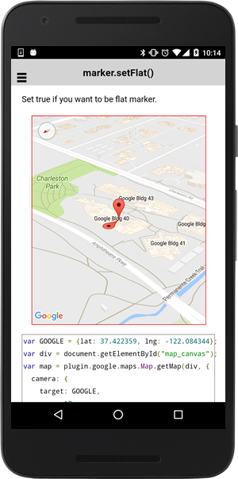

:warning: **This document is aim for older versions (from 2.3.0 to 2.5.3).
Document for new version is https://github.com/mapsplugin/cordova-plugin-googlemaps-doc/blob/master/v2.6.0/README.md**

# marker.setFlat()

Set true if you want to be flat marker.

```
marker.setFlat(flag);
```

## Parameters

name           | type          | description
---------------|---------------|---------------------------------------
flag           | boolean       | `true`: flat, `false`: not flat(default)
-----------------------------------------------------------------------

## Demo code

```html
<div id="map_canvas"></div>
```

```js
var GOOGLE = {lat: 37.422359, lng: -122.084344};
var div = document.getElementById("map_canvas");
var map = plugin.google.maps.Map.getMap(div, {
  camera: {
    target: GOOGLE,
    zoom: 17,
    tilt: 60,
    bearing: 140
  }
});

// Default marker
map.addMarker({
  position: GOOGLE
});

// Flat marker
var flatMarker = map.addMarker({
  position: GOOGLE,
  flat : false     // You can also specify with this property
});

// Marker is going to be flat (like ground overlay)
flatMarker.setFlat(true);

```


