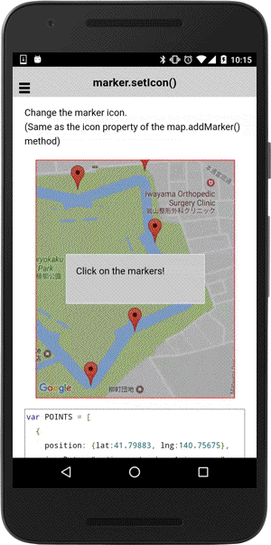

# marker.setIcon()

Change the marker icon.(Same as the icon property of the `map.addMarker()` method)

```
marker.setIcon(icon);
```

## Parameters

name           | type               | description
---------------|--------------------|---------------------------------------
icon           | string, MarkerIcon | icon property
-----------------------------------------------------------------------------

### MarkerIcon

name           | type               | description
---------------|--------------------|---------------------------------------
icon           | string, MarkerIcon | icon property
-----------------------------------------------------------------------------


## Demo code

```html
<div id="map_canvas"></div>
```

```js
var POINTS = [
  {
    position: {lat:41.79883, lng:140.75675},
    iconData: "../images/number-1-icon.png"
  },
  {
    position: {lat:41.799240000000005, lng:140.75875000000002},
    iconData: "http://icons.iconarchive.com/icons/iconarchive/red-orb-alphabet/24/Number-2-icon.png"
  },
  {
    position: {lat:41.797650000000004, lng:140.75905},
    iconData: {
      url: "http://icons.iconarchive.com/icons/iconarchive/red-orb-alphabet/48/Number-3-icon.png",
      size: {
        width: 24,
        height: 24
      }
    }
  },
  {
    position: {lat:41.79637, lng:140.76018000000002},
    title: "4",
    iconData: "blue"
  },
  {
    position: {lat:41.79567, lng:140.75845},
    title: "5",
    iconData:  "data:image/png;base64,iVBORw0KGgoAAAANSUhEUgAAAB4AAAAeCAYAAAA7MK6iAAACVUlEQVRIS8WWjVXCMBRGwwTqBMIEuAG4ARuIE6gTKBOgEyAT4AbABjKBMIE/C+h3m6S2pWlJ8BzfOTkpad6770teEzom3bZy/VbrpYTopDjJZ6w2c77X6p9j46SCUXvuYDxHq04BZ2rPHXa3y/DRqlPAmdqZW+hrkMZEq44F52q3oGTdrjEpqmPBudoxKVBVKqsU1THgPbW+klNUt4GHCn6idqEGuMveerUeXFGtNTCvah9qaz+n2gMmKMGBnLrfjPFcMirZ7231XUF19RUJkIhPZqXnT8AM9Osy62v0VPihUqIfjWwx1RkJvbxIpjArhabfbEJ6zQYwysiiT3CW8kJ6Q4BgqMALEnqVNAqQZGSkM/R7nMOBLhZ/B/ZQeg9V/1EsrpLy5dIqP8aAXV6WlQIlZrWq/wzeBK0DM3Y0vA0aAh8FPwTaBC7B2W8+qUOMT4l9dYUUrJK2k4tCOHl7O7zK+Xx69nbWU/iebgKz1+9E+OYPToR1fqOe+SquujeBWdzlYGBPohhjW9b2lGbRa72bwLdyml5d2auvaPyeTOzIw4MxzCkal8h8no3cqT3WJd0ExuFmOjXmlhRIXbnfKZQ7hfJ4HDTM8wVIMi6xJ01y3mV8E5glGlDRGIEKS75DrAtFn/0DA3x/b0ddZbPgGt23JnBW0agpKPzUGCvhoT4iv1HG9Zodtc6HGBTYnoXAXc3UR5SbBwK1d8y+8RUAzxNwU2orOwQeyolF/lLT7mUqQ8BqCj4Bt+j1lR0Cs3Sopt8GFLYNF/2JU7K2k6stePL7fwP/AER2xy+mY1/QAAAAAElFTkSuQmCC"
  },
  {
    title: "6",
    position: {lat:41.794470000000004, lng:140.75714000000002},
    iconData: window.location.href.replace(/\/([^\/]+)$/, "") + "/../images/number-6-icon.png"
  }/*,
  {
    position: {lat:41.795010000000005, lng:140.75611},
    iconData: "cdvfile://"   // The cdvfile:// protocol is acceptable.
  },
  {
    position: {lat:41.79477000000001, lng:140.75484},
    iconData: "file://"   // The file:// protocol is also acceptable.
  },
  {
    position: {lat:41.79576, lng:140.75475},
    iconData: "/path/to/image/file"  // Absolute path is also acceptable.
  }
  */
];

var mapDiv = document.getElementById("map_canvas");
var map = plugin.google.maps.Map.getMap(mapDiv);
map.one(plugin.google.maps.event.MAP_READY, function() {

  // Add markers
  addMarkers(map, POINTS, function(markers) {

    var bounds = [];
    for(var i = 0; i < markers.length; i++) {
      bounds.push(markers[i].getPosition());
    }

    map.moveCamera({
      target: bounds
    });

  });

});
function addMarkers(map, data, callback) {
  var markers = [];
  function onMarkerAdded(marker) {
    markers.push(marker);

    // If you click on a marker, the marker's icon will be changed.
    marker.on(plugin.google.maps.event.MARKER_CLICK, onMarkerClick);
    marker.on(plugin.google.maps.event.INFO_CLICK, onMarkerClick);

    if (markers.length === data.length) {
      callback(markers);
    }
  }
  data.forEach(function(markerOptions) {
    map.addMarker(markerOptions, onMarkerAdded);
  });
}
function onMarkerClick() {
  var marker = this;
  var iconData = marker.get("iconData");

  // Change the marker icon
  marker.setIcon(iconData);
}
```


