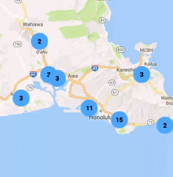
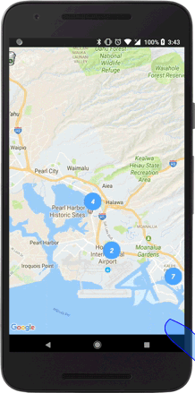
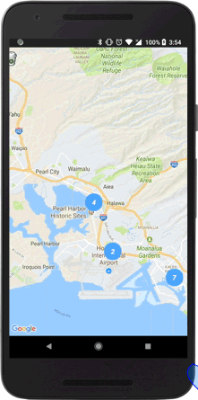

:warning: **This document is aim for older versions (from 2.3.0 to 2.5.3).
Document for new version is https://github.com/mapsplugin/cordova-plugin-googlemaps-doc/blob/master/v2.6.0/README.md**

# MarkerCluster class

_This class extends [BaseClass](../BaseClass/README.md)_.

## Contents

  - <a href="#overview">Overview</a>
    - <a href="#create-a-marker-cluster">Create a marker cluster</a>
    - <a href="#change-the-text-styles">Change the text styles</a>
    - <a href="#get-your-data-from-clicked-marker">Get your data from clicked marker</a>
    - <a href="#remove-the-red-box">Remove the red box</a>
  - <a href="#api-reference">API Reference</a>

------------------------------------------------------------

## Overview

The marker cluster helps you to add bunch of markers on the map.
Closed-locations are clustered to one marker, and the clustered marker displays the number of markers.

If you click on the clustered marker, the map zooms-in to the bounds that contains all markers in that area.

- Example
https://github.com/mapsplugin/marker_cluster_demo



------------------------------------------------------------

### Create a marker cluster

The **map.addMarkerCluster()** method creates an instance marker cluster onto the map.

- The `markers` and `icons` properties are required.
- This method works **after the MAP_READY event**.

```js
var options = {
    'camera': {
        'target': dummyData()[0].position,
        'zoom': 12
    }
};
var map = plugin.google.maps.Map.getMap(mapDiv, options);
map.on(plugin.google.maps.event.MAP_READY, function() {

  //------------------------------------------------------
  // Create a marker cluster.
  // Providing all locations at the creating is the best.
  //------------------------------------------------------
  var markerCluster = map.addMarkerCluster({
    markers: dummyData(),
    icons: [
        {min: 2, max: 100, url: "./img/blue.png", anchor: {x: 16, y: 16}},
        {min: 100, max: 1000, url: "./img/yellow.png", anchor: {x: 16, y: 16}},
        {min: 1000, max: 2000, url: "./img/purple.png", anchor: {x: 24, y: 24}},
        {min: 2000, url: "./img/red.png",anchor: {x: 32,y: 32}}
    ]
  });

});

function dummyData() {
  return [
    {
      "position": {
        "lat": 21.382314,
        "lng": -157.933097
      },
      "name": "Starbucks - HI - Aiea  03641",
      "address": "Aiea Shopping Center_99-115 Aiea Heights Drive #125_Aiea, Hawaii 96701",
      "phone": "808-484-0000",
      "icon": "./img/starbucks.png"
    },
     ...
     ...
     ...
    {
      "position": {
        "lat": 21.3871,
        "lng": -157.9482
      },
      "name": "Starbucks - HI - Aiea  03642",
      "address": "Pearlridge Center_98-125 Kaonohi Street_Aiea, Hawaii 96701",
      "phone": "808-484-0000",
      "icon": "./img/starbucks.png"
    }
  ]
}

```


------------------------------------------------------------

### Change the text styles

You can specify a few style options.

```js
// Available options
var labelOptions = {
  bold: true,
  fontSize: 15,
  color: "white",
  italic: true
};

var markerCluster = map.addMarkerCluster({
  markers: dummyData(),
  icons: [
      {min: 2, max: 100, url: "./img/blue.png", anchor: {x: 16, y: 16}, label: labelOptions},
      {min: 100, max: 1000, url: "./img/yellow.png", anchor: {x: 16, y: 16}, label: labelOptions},
      {min: 1000, max: 2000, url: "./img/purple.png", anchor: {x: 24, y: 24}, label: labelOptions},
      {min: 2000, url: "./img/red.png",anchor: {x: 32,y: 32}, label: labelOptions}
  ]
});
```



------------------------------------------------------------

### Get your data from clicked marker

As well as regular marker, you can store your custom data, then get them later.

```js
var markerCluster = map.addMarkerCluster({
  markers: dummyData(),
  icons: [
      {min: 2, max: 100, url: "./img/blue.png", anchor: {x: 16, y: 16}, label: labelOptions},
      {min: 100, max: 1000, url: "./img/yellow.png", anchor: {x: 16, y: 16}, label: labelOptions},
      {min: 1000, max: 2000, url: "./img/purple.png", anchor: {x: 24, y: 24}, label: labelOptions},
      {min: 2000, url: "./img/red.png",anchor: {x: 32,y: 32}, label: labelOptions}
  ]
});

markerCluster.on(plugin.google.maps.event.MARKER_CLICK, function (position, marker) {
  alert(marker.get("name"));
});

```



------------------------------------------------------------

### Remove the red box

If you want to remove the red box, you just set `boundsDraw = false`.

```js
var markerCluster = map.addMarkerCluster({
  boundsDraw: false
  markers: dummyData(),
  icons: [
      {min: 2, max: 100, url: "./img/blue.png", anchor: {x: 16, y: 16}},
      {min: 100, max: 1000, url: "./img/yellow.png", anchor: {x: 16, y: 16}},
      {min: 1000, max: 2000, url: "./img/purple.png", anchor: {x: 24, y: 24}},
      {min: 2000, url: "./img/red.png",anchor: {x: 32,y: 32}}
  ]
});
```


------------------------------------------------------------

## API Reference

### Create

<table>
  <tr>
    <th><a href="./addMarkerCluster/README.md">map.addMarkerCluster()</a></th>
    <td>Add a marker cluster.</td>
  </tr>
</table>


### Methods

<table>
  <tr>
    <th>addMarker()</th>
    <td>Add one location.</td>
  </tr>
  <tr>
    <th>addMarkers()</th>
    <td>Add multiple locations.</td>
  </tr>
  <tr>
    <th>remove()</th>
    <td>Remove the marker cluster.</td>
  </tr>
</table>


### Events

<table>
  <tr>
    <th>MARKER_CLICK</th>
    <td>Arguments:  <a href="../LatLng/README.md">LatLng</a>, <a href="../Marker/README.md">Marker</a><br>This event is fired when you click on a marker.</td>
  </tr>
</table>
