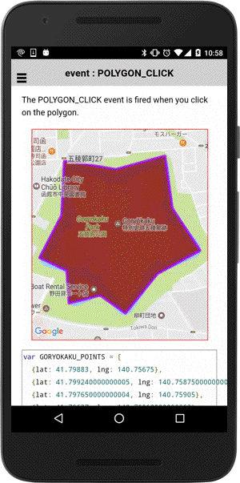

# event: POLYGON_CLICK

The POLYGON_CLICK event is fired when you click on the polygon.

```
polygon.on(plugin.google.maps.event.POLYGON_CLICK, onPolygonClick);

function onPolygonClick(latLng) {
  var polygon = this;
}
```

## Parameters

name           | type          | description
---------------|---------------|---------------------------------------
latLng         | LatLng        | clicked position
-----------------------------------------------------------------------

## Demo code

```html
<div id="map_canvas"></div>
```

```js
var GORYOKAKU_POINTS = [
  {lat: 41.79883, lng: 140.75675},
  {lat: 41.799240000000005, lng: 140.75875000000002},
  {lat: 41.797650000000004, lng: 140.75905},
  {lat: 41.79637, lng: 140.76018000000002},
  {lat: 41.79567, lng: 140.75845},
  {lat: 41.794470000000004, lng: 140.75714000000002},
  {lat: 41.795010000000005, lng: 140.75611},
  {lat: 41.79477000000001, lng: 140.75484},
  {lat: 41.79576, lng: 140.75475},
  {lat: 41.796150000000004, lng: 140.75364000000002},
  {lat: 41.79744, lng: 140.75454000000002},
  {lat: 41.79909000000001, lng: 140.75465},
  {lat: 41.79883, lng: 140.75673}
];

var mapDiv = document.getElementById("map_canvas");
var map = plugin.google.maps.Map.getMap(mapDiv, {
  camera: {
    target: GORYOKAKU_POINTS
  }
});

// Show a virtual dialog (loader.js)
showVirtualDialog(mapDiv, "Click on the polygon!");

// Add a polygon
var polygon = map.addPolygon({
  'points': GORYOKAKU_POINTS,
  'strokeColor' : '#AA00FF',
  'strokeWidth': 5,
  'fillColor' : '#880000',
  'clickable' : true  // default = false
});

// Catch the POLYGON_CLICK event
polygon.on(plugin.google.maps.event.POLYGON_CLICK, function(clickLatLng) {

  // You can change the style for instance.
  polygon.setFillColor("blue");
  polygon.setStrokeColor("green");
  polygon.setStrokeWidth(10);

  var marker = map.addMarker({
    position: clickLatLng,
    title: "You clicked here on the polygon!",
    snippet: clickLatLng.toUrlValue()
  });

  marker.showInfoWindow();

});
```


