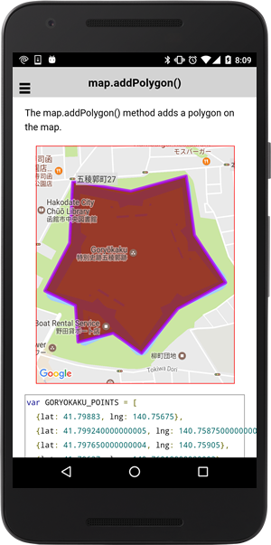

# map.addPolygon()

The map.addPolygon() method adds a polygon on the map.

```
(from v2.3.0 to current)
var polygon = map.addPolygon(options)

(from v2.0.0 to current)
map.addPolygon(options, callback);
```

## Options

params         | type          | description
---------------|---------------|-----------------------------------------------------------------
points         | ILatLng[]     | The ordered sequence of coordinates that designates a closed loop.
holes?         | ILatLng[][]   | (optional) A hole is a region inside the polygon that is not filled.
geodesic       | boolean       | (optional) set `true`, edges of the polygon are interpreted as geodesic and will follow the curvature of the Earth.
strokeColor?   | string        | (optional) stroke color (HTML colors)
strokeWidth?   | number        | (optional) stroke width in pixels
fillColor?     | string        | (optional) inside filling color
clickable?     | boolean       | (optional) set `true` to receive the `POLYGON_CLICK` event
visible?       | boolean       | (optional) set `false` to create invisible polygon
z-index?       | number        | (optional) z-index
-------------------------------------------------------------------------------------------------

## Demo code

```html
<div id="map_canvas"></div>
```

```js
var GORYOKAKU_POINTS = [
  {lat: 41.79883, lng: 140.75675},
  {lat: 41.799240000000005, lng: 140.75875000000002},
  {lat: 41.797650000000004, lng: 140.75905},
  {lat: 41.79637, lng: 140.76018000000002},
  {lat: 41.79567, lng: 140.75845},
  {lat: 41.794470000000004, lng: 140.75714000000002},
  {lat: 41.795010000000005, lng: 140.75611},
  {lat: 41.79477000000001, lng: 140.75484},
  {lat: 41.79576, lng: 140.75475},
  {lat: 41.796150000000004, lng: 140.75364000000002},
  {lat: 41.79744, lng: 140.75454000000002},
  {lat: 41.79909000000001, lng: 140.75465},
  {lat: 41.79883, lng: 140.75673}
];
var mapDiv = document.getElementById("map_canvas");
var map = plugin.google.maps.Map.getMap(mapDiv, {
  camera: {
    target: GORYOKAKU_POINTS
  }
});

// Add polygon
var polygon = map.addPolygon({
  'points': GORYOKAKU_POINTS,
  'strokeColor' : '#AA00FF',
  'strokeWidth': 5,
  'fillColor' : '#880000'
});

```


