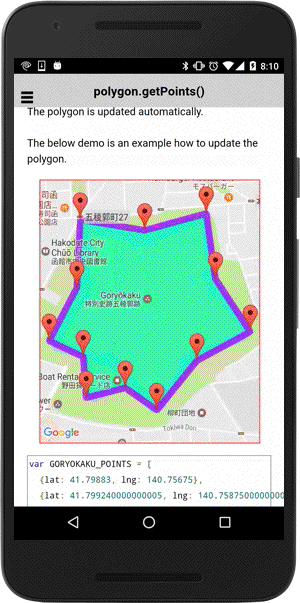

# polygon.getPoints()

The getPoints() method returns an instance of [BaseArrayClass](../../BaseArrayClass/README.md).
You can modify the array instance using `insertAt()`, `setAt()`, and `removeAt()` methods.
The polygon is updated automatically.

```
var points = polygon.getPoints();
```

------------------------------------------------------------------------------------------

## Demo code

The below demo is an example how to update the polygon.

```html
<div  id="map_canvas"></div>
```

```js
var GORYOKAKU_POINTS = [
  {lat: 41.79883, lng: 140.75675},
  {lat: 41.799240000000005, lng: 140.75875000000002},
  {lat: 41.797650000000004, lng: 140.75905},
  {lat: 41.79637, lng: 140.76018000000002},
  {lat: 41.79567, lng: 140.75845},
  {lat: 41.794470000000004, lng: 140.75714000000002},
  {lat: 41.795010000000005, lng: 140.75611},
  {lat: 41.79477000000001, lng: 140.75484},
  {lat: 41.79576, lng: 140.75475},
  {lat: 41.796150000000004, lng: 140.75364000000002},
  {lat: 41.79744, lng: 140.75454000000002},
  {lat: 41.79909000000001, lng: 140.75465}//,
  //{lat: 41.79883, lng: 140.75673}
];

var mapDiv = document.getElementById("map_canvas");

// Create a map with specified camera bounds
var map = plugin.google.maps.Map.getMap(mapDiv, {
  camera: {
    target: GORYOKAKU_POINTS
  }
});

  var polygon = addEditablePolygon(map, GORYOKAKU_POINTS);

});

function addEditablePolygon(map, points) {

  // Add a polygon
  var polygon = map.addPolygon({
    'points': points,
    'strokeColor' : '#AA00FF',
    'fillColor' : '#00FFAA',
    'width': 10
  });

  // polygon.getPoints() returns an instance of the BaseArrayClass.
  var mvcArray = polygon.getPoints();

  // Add draggable markers
  points.forEach(function(point, idx) {
    var marker = map.addMarker({
      position: latLng,
      draggable: true
    });

    // If a marker is dragged, set the position of it to the points of the Polygon.
    marker.on(plugin.google.maps.event.MARKER_DRAG, function(position) {
      mvcArray.setAt(idx, position);
    });

  });

  return polygon;

}
```


