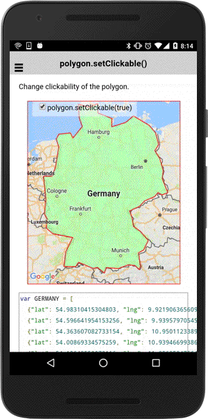

# polygon.setClickable()

Enables or disables click events for this polygon.

```js
polygon.setClickable(flag);
```


## Parameters

name           | type          | description
---------------|---------------|---------------------------------------
flag           | boolean       | `true`: clickable, `false`: non-clickable
-----------------------------------------------------------------------

## Demo code

```html
<div class="map" id="map_canvas">
  <span class="smallPanel"><input type="checkbox" id="toggleCheckbox" checked="checked">polygon.setClickable(true)</span>
</div>
```

```js
var GERMANY = [
  {"lat": 54.98310415304803, "lng": 9.921906365609232},
  {"lat": 54.596641954153256, "lng": 9.9395797054529},
  {"lat": 54.363607082733154, "lng": 10.950112338920519},
  {"lat": 54.00869334575259, "lng": 10.93946699386845},
  {"lat": 54.19648550070116, "lng": 11.956252475643282},
  {"lat": 54.470370591847995, "lng": 12.518440382546714},
  {"lat": 54.0755109727059, "lng": 13.647467075259499},
  {"lat": 53.75702912049104, "lng": 14.119686313542559},
  {"lat": 53.248171291713106, "lng": 14.353315463934166},
  {"lat": 52.98126251892535, "lng": 14.074521111719434},
  {"lat": 52.624850165408304, "lng": 14.437599725002201},
  {"lat": 52.089947414755216, "lng": 14.685026482815715},
  {"lat": 51.74518809671997, "lng": 14.607098422919648},
  {"lat": 51.10667409932171, "lng": 15.016995883858783},
  {"lat": 51.00233938252438, "lng": 14.570718214586122},
  {"lat": 51.11726776794137, "lng": 14.307013380600665},
  {"lat": 50.92691762959436, "lng": 14.056227654688314},
  {"lat": 50.73323436136428, "lng": 13.338131951560399},
  {"lat": 50.48407644306917, "lng": 12.96683678554325},
  {"lat": 50.26633779560723, "lng": 12.240111118222671},
  {"lat": 49.96912079528062, "lng": 12.415190870827473},
  {"lat": 49.54741526956275, "lng": 12.521024204161336},
  {"lat": 49.30706818297324, "lng": 13.031328973043514},
  {"lat": 48.877171942737164, "lng": 13.595945672264577},
  {"lat": 48.41611481382904, "lng": 13.243357374737116},
  {"lat": 48.28914581968786, "lng": 12.884102817443875},
  {"lat": 47.63758352313596, "lng": 13.025851271220517},
  {"lat": 47.467645575544, "lng": 12.932626987366064},
  {"lat": 47.672387600284424, "lng": 12.620759718484521},
  {"lat": 47.70308340106578, "lng": 12.141357456112871},
  {"lat": 47.52376618101306, "lng": 11.426414015354851},
  {"lat": 47.5663992376538, "lng": 10.544504021861599},
  {"lat": 47.30248769793917, "lng": 10.402083774465325},
  {"lat": 47.580196845075704, "lng": 9.89606814946319},
  {"lat": 47.5250580918202, "lng": 9.594226108446378},
  {"lat": 47.83082754169135, "lng": 8.522611932009795},
  {"lat": 47.61357982033627, "lng": 8.317301466514095},
  {"lat": 47.62058197691192, "lng": 7.466759067422288},
  {"lat": 48.33301911070373, "lng": 7.593676385131062},
  {"lat": 49.01778351500343, "lng": 8.099278598674857},
  {"lat": 49.20195831969164, "lng": 6.65822960778371},
  {"lat": 49.463802802114515, "lng": 6.186320428094177},
  {"lat": 49.90222565367873, "lng": 6.242751092156993},
  {"lat": 50.128051662794235, "lng": 6.043073357781111},
  {"lat": 50.80372101501058, "lng": 6.15665815595878},
  {"lat": 51.851615709025054, "lng": 5.988658074577813},
  {"lat": 51.852029120483394, "lng": 6.589396599970826},
  {"lat": 52.22844025329755, "lng": 6.842869500362383},
  {"lat": 53.144043280644894, "lng": 7.092053256873896},
  {"lat": 53.48216217713065, "lng": 6.905139601274129},
  {"lat": 53.69393219666267, "lng": 7.100424838905269},
  {"lat": 53.74829580343379, "lng": 7.936239454793963},
  {"lat": 53.52779246684429, "lng": 8.121706170289485},
  {"lat": 54.020785630908904, "lng": 8.800734490604668},
  {"lat": 54.39564647075406, "lng": 8.57211795414537},
  {"lat": 54.96274363872516, "lng": 8.526229282270208},
  {"lat": 54.83086538351631, "lng": 9.282048780971138},
  {"lat": 54.98310415304803, "lng": 9.921906365609232}
];
var mapDiv = document.getElementById("map_canvas");

// Create a map with specified camera bounds
var map = plugin.google.maps.Map.getMap(mapDiv, {
  camera: {
    target: GERMANY
  }
});

// Add a polygon
var polygon = map.addPolygon({
  'points': GERMANY,
  'fillColor' : '#AAFFAA',
  'strokeColor' : '#FF0000',
  'strokeWidth': 2,
  'clickable': true  // default = false
});

var checkbox = document.getElementById("toggleCheckbox");
checkbox.addEventListener("change", function() {

  // Change the clickable property
  polygon.setClickable(checkbox.checked);

});


polygon.on(plugin.google.maps.event.POLYGON_CLICK, function(latLng) {
  alert("polygon is clicked!");
});

```


