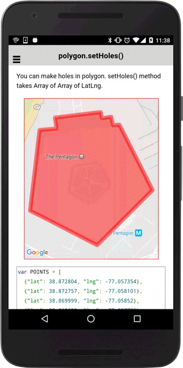

:warning: **This document is aim for older versions (from 2.3.0 to 2.5.3).
Document for new version is https://github.com/mapsplugin/cordova-plugin-googlemaps-doc/blob/master/v2.6.0/README.md**

# polygon.setHoles()

Create new holes into the polygon.

```js
polygon.setHoles(holes);
```

## Parameters

name           | type          | description
---------------|---------------|---------------------------------------
holes          | ILatLng[][]   | new holes
-----------------------------------------------------------------------

## Demo code


You can make holes in polygon.
setHoles() method takes Array of Array of LatLng.

```html
<div id="map_canvas"></div>
```

```js
var POINTS = [
  {"lat": 38.872804, "lng": -77.057354},
  {"lat": 38.872757, "lng": -77.058101},
  {"lat": 38.869999, "lng": -77.05852},
  {"lat": 38.869689, "lng": -77.057723},
  {"lat": 38.868822, "lng": -77.055574},
  {"lat": 38.870706, "lng": -77.05314},
  {"lat": 38.872939, "lng": -77.054602},
  {"lat": 38.872916, "lng": -77.054878},
  {"lat": 38.873207, "lng": -77.054959},
  {"lat": 38.873156, "lng": -77.055368},
  {"lat": 38.873367, "lng": -77.055418},
  {"lat": 38.87318,  "lng": -77.057427}
];

var HOLES = [
  [
    {"lat":38.870605, "lng":-77.05687},
    {"lat":38.87154,  "lng":-77.056657},
    {"lat":38.871734, "lng":-77.055464},
    {"lat":38.870885, "lng":-77.054884},
    {"lat":38.870203, "lng":-77.055801}
  ]
];
var mapDiv = document.getElementById("map_canvas");

// Create a map with specified camera bounds
var map = plugin.google.maps.Map.getMap(mapDiv, {
  camera: {
    target: POINTS
  }
});

// Show a virtual dialog (loader.js)
showVirtualDialog(mapDiv, "Click on the polygon");

var polygon = map.addPolygon({
  points: POINTS,
  clickable: true // default = false
});

polygon.on(plugin.google.maps.event.POLYGON_CLICK, function(latLng) {

  polygon.setHoles(HOLES);

});

```


