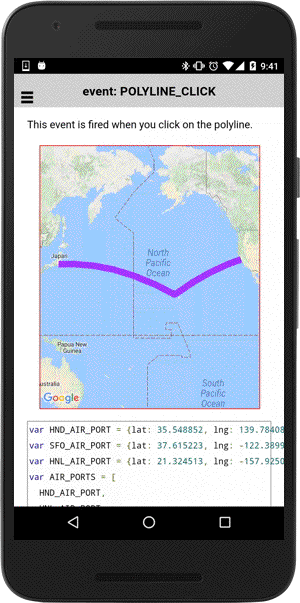
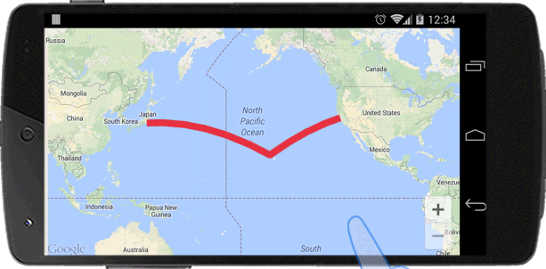

# Polyline class

_This class extends [BaseClass](../BaseClass/README.md)_.

## Contents

  - <a href="#overview">Overview</a>
    - <a href="#create-one-polyline">Create one polyline</a>
    - <a href="#click-event">Click event</a>
    - <a href="#update-the-polyline">Update the polyline</a>
    - <a href="#assign-your-data">Assign your data</a>
  - <a href="#api-reference">API Reference</a>

------------

## Overview


### Create one polyline

The **map.addPolyline()** method draws one polyline onto the map.

- _This method works **after the MAP_READY event**._

```js
var HND_AIR_PORT = {lat: 35.548852, lng: 139.784086};
var SFO_AIR_PORT = {lat: 37.615223, lng: -122.389979};
var HNL_AIR_PORT = {lat: 21.324513, lng: -157.925074};
var AIR_PORTS = [
  HND_AIR_PORT,
  HNL_AIR_PORT,
  SFO_AIR_PORT
];

var mapDiv = document.getElementById("map_canvas");

// Create a map with specified camera bounds
var map = plugin.google.maps.Map.getMap(mapDiv, {
  camera: {
    target: AIR_PORTS
  }
});

// Add a polyline
map.addPolyline({
  'points': AIR_PORTS,
  'color' : '#AA00FF',
  'width': 10,
  'geodesic': true
});

```


------------

### Click event

The `POLYLINE_CLICK` event is fired when you tap on the polyline with clicked position ([LatLng](../LatLng/README.md) object);

```js
// Add a polyline
var polyline = map.addPolyline({
  points: AIR_PORTS,
  'color' : '#AA00FF',
  'width': 10,
  'geodesic': true,
  'clickable': true // default = false
});

// Catch the POLYLINE_CLICK event
polyline.on(plugin.google.maps.event.POLYLINE_CLICK, function(latLng) {

  var marker = map.addMarker({
    position: latLng,
    title: "You clicked on the polyline",
    snippet: latLng.toUrlValue(),
    disableAutoPan: true
  });
  marker.showInfoWindow();

});
```



------------

### Update the polyline

The `getPoints()` method returns an instance of [BaseArrayClass](../BaseArrayClass/README.md).
If you change the element value of it, the polyline is also updated automatically.
Also if you add new element, or remove one of them, the polyline is also updated.

```js
// Add a polyline
var polyline = map.addPolyline({
  'points': points,
  'color' : '#AA00FF',
  'width': 10,
  'geodesic': true
});


// polyline.getPoints() returns an instance of BaseArrayClass.
var mvcArray = polyline.getPoints();

// Add draggable markers
points.forEach(function(point, idx) {
  var marker = map.addMarker({
    position: latLng,
    draggable: true
  });
  
  // If a marker is dragged, set the position of it to the points of the Polygon.
  marker.on(plugin.google.maps.event.MARKER_DRAG, function(position) {
    mvcArray.setAt(idx, position);
  });
});
```


------------

#### Assign your data

Since Polyline class extends [BaseClass](../BaseClass/README.md), you can assign your data.

```js
const HND_AIR_PORT = {"lat": 35.548852, "lng": 139.784086};
const SFO_AIR_PORT = {"lat": 37.615223, "lng": -122.389979};
const HNL_AIR_PORT = {"lat": 21.332898, "lng": -157.921418};

//---------------------------------
// [Model]
//    Create one polyline
//---------------------------------
var polyline = map.addPolyline({
  'points': [
    HND_AIR_PORT,
    HNL_AIR_PORT,
    SFO_AIR_PORT
  ],
  'color' : "red",
  'width': 10,
  'geodesic': true,
  'idx': 0
});

//---------------------------------
// [Control]
//    Increment the idx field.
//    If the value is grater than 3,
//    reset to 0.
//---------------------------------
polyline.on(plugin.google.maps.event.POLYLINE_CLICK, function() {
  var idx = this.get("idx");
  idx = idx + 1;
  this.set("idx", idx > 3 ? 0 : idx);
});

//---------------------------------
// [View]
//    Update the polyline color
//    based on the idx field.
//---------------------------------
polyline.on("idx_changed", function() {
  var idx = this.get("idx");
  this.setColor(["green", "blue", "orange", "red"][idx]);
});
```



------------

## API Reference

### Create

<table>
    <tr>
        <th><a href="./addPolyline/README.md">map.addPolyline()</a></th>
        <td>Add a polyline.</td>
    </tr>
</table>

### Methods
<table>
    <tr>
        <th><a href="./setPoints/README.md">setPoints()</a></th>
        <td>Changes the polyline points.</td>
    </tr>
    <tr>
        <th><a href="./getPoints/README.md">getPoints()</a></th>
        <td>Returns an instance of the [BaseArrayClass](../../BaseArrayClass/index/README.md).<br>
          You can modify the points.</td>
    </tr>
    <tr>
        <th><a href="./setGeodesic/README.md">setGeodesic()</a></th>
        <td>When true, edges of the polyline are interpreted as geodesic and will follow the curvature of the Earth. </td>
    </tr>
    <tr>
        <th>getGeodesic()</th>
        <td>Returns true if the polyline is geodesic.</td>
    </tr>
    <tr>
        <th><a href="./setVisible/README.md">setVisible()</a></th>
        <td>Changes visibility of the polyline.</td>
    </tr>
    <tr>
        <th>getVisible()</th>
        <td>Returns true if the polyline is visible.</td>
    </tr>
    <tr>
        <th><a href="./setClickable/README.md">setClickable()</a></th>
        <td>Changes click-ability of the polyline.</td>
    </tr>
    <tr>
        <th>getClickable()</th>
        <td>Returns true if the polyline is clickable.</td>
    </tr>
    <tr>
        <th><a href="./setStrokeColor/README.md">setStrokeColor()</a></th>
        <td>Changes the polyline color.</td>
    </tr>
    <tr>
        <th>getStrokeColor()</th>
        <td>Returns the current polyline color.</td>
    </tr>
    <tr>
        <th><a href="./setStrokeWidth/README.md">setStrokeWidth()</a></th>
        <td>Changes the polyline stroke width.</td>
    </tr>
    <tr>
        <th>getStrokeWidth()</th>
        <td>Returns the current stroke width (unit: pixel).</td>
    </tr>
    <tr>
        <th><a href="./setZIndex/README.md">setZIndex()</a></th>
        <td>Changes the polyline zIndex order.</td>
    </tr>
    <tr>
        <th>getZIndex()</th>
        <td>Returns the current polyline zIndex.</td>
    </tr>
    <tr>
        <th><a href="./remove/README.md">remove()</a></th>
        <td>Removes the polyline.</td>
    </tr>
    <tr>
        <th>getMap()</th>
        <td>Returns the map reference.</td>
    </tr>
</table>

### Events

<table>
    <tr>
        <th><a href="./POLYLINE_CLICK/README.md">POLYLINE_CLICK</a></th>
        <td>Arguments:  <a href="../LatLng/README.md">LatLng</a><br>This event is fired when you click on the polyline.</td>
    </tr>
</table>
