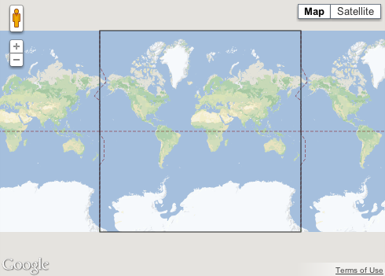
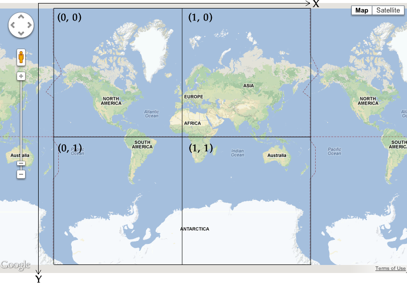

:warning: **This document is aim for older versions (from 2.3.0 to 2.5.3).
Document for new version is https://github.com/mapsplugin/cordova-plugin-googlemaps-doc/blob/master/v2.6.0/README.md**

# TileOverlay class

_This class extends [BaseClass](../BaseClass/README.md)_.

## Contents

  - <a href="#overview">Overview</a>
    - <a href="#create-one-polyline">Create one polyline</a>
    - <a href="#click-event">Click event</a>
    - <a href="#update-the-polyline">Update the polyline</a>
    - <a href="#assign-your-data">Assign your data</a>
  - <a href="#api-reference">API Reference</a>

------------------------------------------------------------------------------------

## Overview

You can add images on top of your map as a Tile Layer.
Tile Layers are placed overtop of a map tile at a specific zoom level.
With enough tiles, you can supplement Google's map data for the entire map,
at multiple zoom levels.

This is an excellent way to add data - such as points of interest or traffic information - and local imagery to your app. When combined with `plugin.google.maps.MapTypeId.NONE`, tile layers effectively let you replace Google's base map data with your own.

-------------------------------------------------------------------

### Tile Coordinates

The Maps API breaks up imagery at each zoom level into a set of square map tiles, which are arranged in an ordered grid. When a map scrolls to a new location, or to a new zoom level, the Maps API determines which tiles are needed, and translates that into a set of tiles to retrieve.

For Google's implementation of the Mercator projection, the tile with coordinate (0,0) is always at the northwest corner of the map, with `x` values increasing from west to east and `y` values increasing from north to south. Tiles are indexed using `x, y` coordinates from that origin.

For example, at zoom level 2, when the earth is divided up into 16 tiles, each tile can be referenced by a unique `x,y` pair:


Each map tile is a 512x512 point square. At zoom level 0, the entire world is rendered in a single tile (**however, the native Google Maps APIs do not support this zoom level**).



So, at zoom level 1 the map will be rendered as a 2x2 grid of tiles, or a 4x4 grid at zoom level2, and so on.



If you are creating images for a tile layer, you will need to create a new 512x512 point image for each tile at each zoom level that you with to support.


-------------------------------------------------------------------

### Add a tile layer

The **map.addTileLayer()** method generates a tile layer on the map.

```js
var mapDiv = document.getElementById("map_canvas");
var map = plugin.google.maps.Map.getMap(mapDiv, {
  //'mapType' : plugin.google.maps.MapTypeId.NONE,
  'preferences': {
    'zoom': {
      'minZoom': 0,
      'maxZoom': 4
    }
  }
});

var tileOverlay = map.addTileOverlay({
  debug: true,  // draw the debug information on tiles

  opacity: 0.75,  // from 0.0 to 1.0

  // Load image files from the local file path
  getTile: function(x, y, zoom) {
    return "http://tile.openstreetmap.org/" + zoom + "/" + x + "/" + y + ".png";
  }
});
```


------------------------------------------------------------------------------------

## API Reference

### Create

<table>
    <tr>
        <th><a href="./addTileOverlay/README.md">map.addTileOverlay()</a></th>
        <td>Adds a tile layer.</td>
    </tr>
</table>

### Methods

<table>
    <tr>
        <th><a href="./setFadeIn/README.md">setFadeIn()</a></th>
        <td>Sets whether the tiles should fade in.</td>
    </tr>
    <tr>
        <th>getFadeIn()</th>
        <td>Returns whether the tiles should fade in.</td>
    </tr>
    <tr>
        <th><a href="./setZIndex/README.md">setZIndex()</a></th>
        <td>Sets the zIndex of the tile overlay.</td>
    </tr>
    <tr>
        <th>getZIndex()</th>
        <td>Returns the zIndex of the tile overlay.</td>
    </tr>
    <tr>
        <th><a href="./setOpacity/README.md">setOpacity()</a></th>
        <td>Sets the opacity of the tile overlay.</td>
    </tr>
    <tr>
        <th>getOpacity()</th>
        <td>Returns the opacity of the tile overlay.</td>
    </tr>
    <tr>
        <th><a href="./setVisible/README.md">setVisible()</a></th>
        <td>Sets false if you want to hide.</td>
    </tr>
    <tr>
        <th>getVisible()</th>
        <td>Returns true if the tile overlay is visible.</td>
    </tr>
    <tr>
        <th>getTileSize()</th>
        <td>Returns true if the tile overlay is visible.</td>
    </tr>
    <tr>
        <th><a href="./remove/README.md">remove()</a></th>
        <td>Removes the tile overlay.</td>
    </tr>
    <tr>
        <th>getMap()</th>
        <td>Returns the map reference.</td>
    </tr>
</table>
