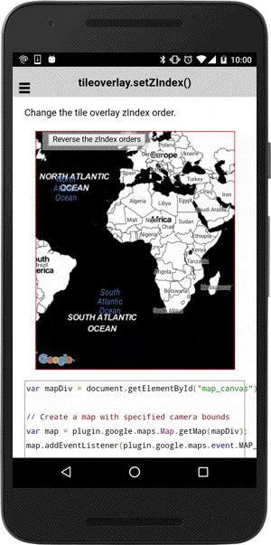

:warning: **This document is aim for older versions (from 2.3.0 to 2.5.3).
Document for new version is https://github.com/mapsplugin/cordova-plugin-googlemaps-doc/blob/master/v2.6.0/README.md**

# tileOverlay.setZIndex()

Change the order in which this tile overlay is drawn with respect to other overlays (including GroundOverlays, Polylines, Polygons, and Circles but not Markers).

```
polyline.setZIndex(index);
```

## Parameters

name           | type          | description
---------------|---------------|---------------------------------------
index          | number        | z-index (default: 0)
-----------------------------------------------------------------------

## Demo code
```js
<div id="map_canvas">
  <span class="smallPanel"><button>Reverse the zIndex orders</button></span>
</div>
```

```js
var mapDiv = document.getElementById("map_canvas");

// Create a map with specified camera bounds
var map = plugin.google.maps.Map.getMap(mapDiv);
map.addEventListener(plugin.google.maps.event.MAP_READY, function() {

  var tileList = [

    "../images/map-for-free/{zoom}_{x}-{y}.gif",
    "http://tile.stamen.com/toner/{zoom}/{x}/{y}.png"
  ];
  var layers = [];
  tileList.forEach(function(layerUrl, idx) {

    // Create a layer
    map.addTileOverlay({
      getTile: function(x, y, zoom) {
        return layerUrl.replace("{zoom}", zoom)
                  .replace("{x}", x)
                  .replace("{y}", y);
      }
    }, function(layer) {

      layers.push(layer);

    });

  });

  // Change the layer zIndex orders.
  var button = document.getElementsByTagName("button")[0];
  button.addEventListener("click", function() {
    layers = layers.reverse();
    layers.forEach(function(layer, idx) {
        layer.setZIndex(idx);
    });

  });

});
```


