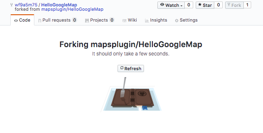
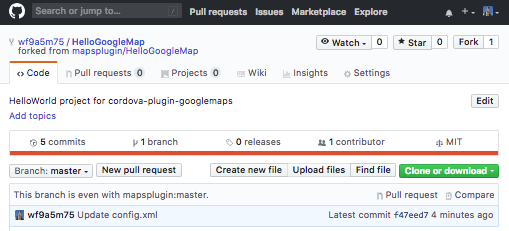
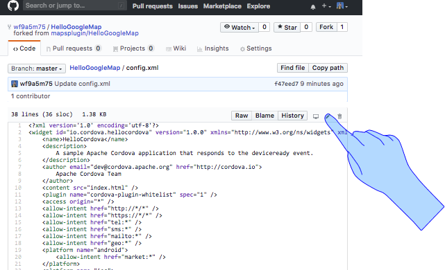
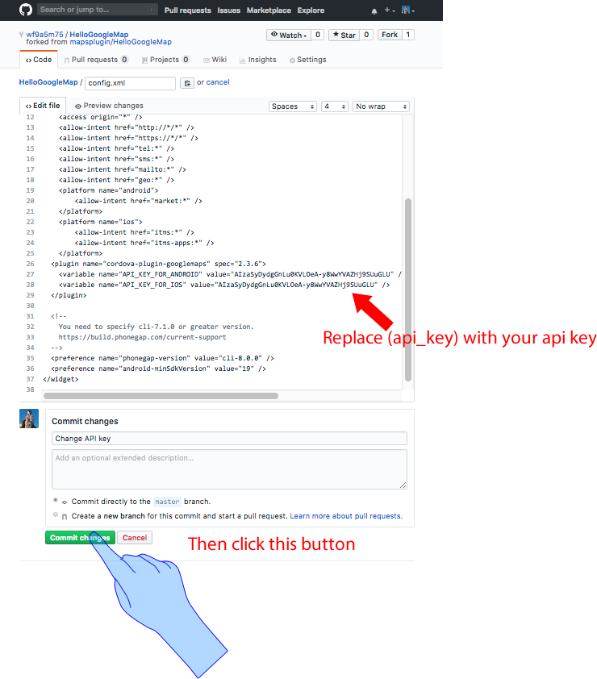
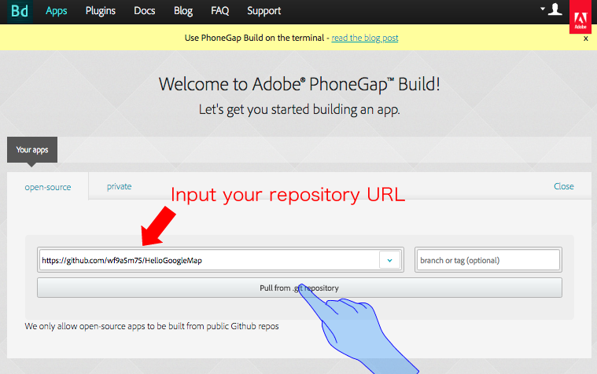
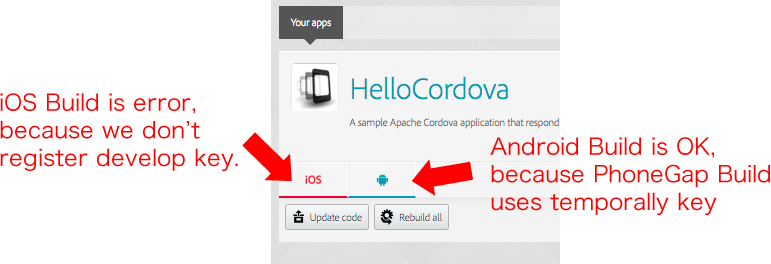
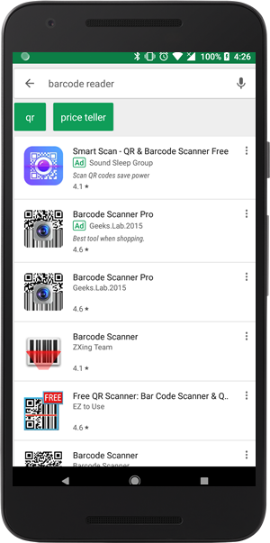
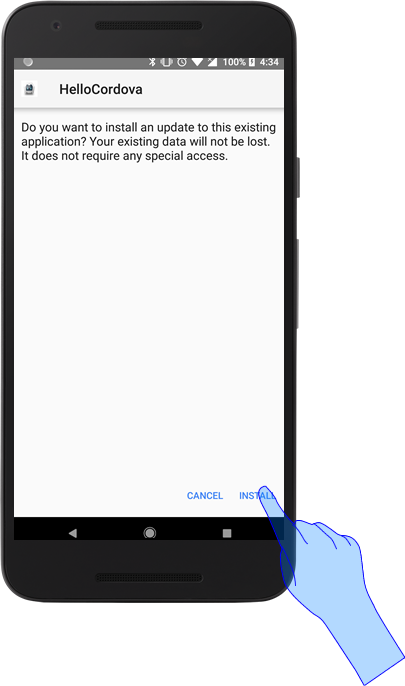

# Hello, World for PhoneGap Build

The easiest way to start learning about the cordova-plugin-googlemaps is to create a simple application step by step.

--------------------------------------------

## Step 1: Fork sample project

Visit https://github.com/mapsplugin/HelloGoogleMap, then folk the project.


Wait a second...



Done! This is your repository.




--------------------------------------------

## Step 2: Create an API key.

In order to use the **cordova-plugin-googlemaps**, you need to generate an API key at the Google APIs console.

Please follow this tutorial.

https://github.com/mapsplugin/cordova-plugin-googlemaps-doc/blob/master/v2.3.0/api_key/README.md


--------------------------------------------

## Step 3: Modify the `config.xml` file.

Open `config.xml` file page on your browser, then click the pencil mark.



Replace `(api_key)` with the api key you generated above.



Okay, it's ready to build now!

--------------------------------------------

## Step 4: Go to Adobe PhoneGap Build

Go to https://build.phonegap.com/apps, then copy and paste your repository URL.

Then click the `[Pull from .git repository]` button.




--------------------------------------------

## Step 6: Build the app!

Ok, let's build the app!


After a moment (typically 1 minutes), you will see like below.
If you are this is the first time experience, you probably don't register your iOS developer key. So you will get iOS build error, but ignore it.




--------------------------------------------

## Step 7: Go to your Android Phone

The easiest way to install this generated application to your app,
install a `Barcode reader` application from Google Play Store.

https://play.google.com/store/search?q=barcode+reader&c=apps




Open the barcode scanner app, and read the project barcode.
The barcode app displays a URL.


Download the apk file,


then install it.




--------------------------------------------

## Step 8: Open the app!


You should see a Google Maps in the app!


--------------------------------------------

## Understanding the code

Let's check the `www/index.html` file.
The below is entire code.

```html
<!DOCTYPE html>
<html>
  <head>
    <meta name="viewport" content="width=device-width">
    <script type="text/javascript" src="cordova.js"></script>
    <script type="text/javascript">
    document.addEventListener("deviceready", function() {
      var div = document.getElementById("map_canvas");

      // Create a Google Maps native view under the map_canvas div.
      var map = plugin.google.maps.Map.getMap(div);

      // If you click the button, do something...
      var button = document.getElementById("button");
      button.addEventListener("click", function() {

        // Move to the position with animation
        map.animateCamera({
          target: {lat: 37.422359, lng: -122.084344},
          zoom: 17,
          tilt: 60,
          bearing: 140,
          duration: 5000
        });

        // Add a maker
        var marker = map.addMarker({
          position: {lat: 37.422359, lng: -122.084344},
          title: "Welecome to \n" +
                 "Cordova GoogleMaps plugin for iOS and Android",
          snippet: "This plugin is awesome!",
          animation: plugin.google.maps.Animation.BOUNCE
        });

        // Show the info window
        marker.showInfoWindow();

      });

    }, false);

    </script>
    <style type="text/css">
    #map_canvas { /* Must bigger size than 100x100 pixels */
      width: 100%;
      height: 500px;
    }
    button {
      padding: .5em;
      margin: .5em;
    }
    </style>
  </head>
  <body>
    <h1>Hello, World!</h1>
    <div id="map_canvas">
      <button id="button">Click me!</button>
    </div>
  </body>
</html>
```


The code below defines an area of the page for your Google map.

```html
<div id="map_canvas">
  <button id="button">Click me!</button>
</div>
```

In the cordova-plugin-googlemaps, you must set bigger size to it than 100x100 pixels.

```css
#map_canvas { /* Must bigger size than 100x100 pixels */
  width: 100%;
  height: 500px;
}
```

Cordova framework has two sides:

code area  | Description
-----------|-----------------------
JavaScript | Your main code (www/index.html). Easy to understand and run. No compiling is necessary.
Native code| Code is written by native languages, such as Java or Swift. Difficult to understand than JavaScript, but faster than JavaScript.

Cordova framework notifies `deviceready` event when the native code area is ready to use.
You have to start your code from here.

```js
document.addEventListener('deviceready', function() {

  // The cordova-plugin-googlemaps is ready to use.

});
```

The code below constructs a new Google maps object.
At this point in this tutorial, you just see a map.

```js
var div = document.getElementById("map_canvas");

// Create a Google Maps native view under the map_canvas div.
var map = plugin.google.maps.Map.getMap(div);
```


The below code changes the map camera view into particular location.
The `target` property tells the API where to center the map. The map coordinates are set in the order: **latitude, longitude**.

```js
map.animateCamera({
  target: {lat: 37.422359, lng: -122.084344},
  zoom: 17,
  tilt: 60,
  bearing: 140,
  duration: 5000
});
```


The below code puts a marker on the map. This code executes **after the map.animateCamera() is finished**.

```js
// Add a maker
var marker = map.addMarker({
  position: {lat: 37.422359, lng: -122.084344},
  title: "Welecome to \n" +
         "Cordova GoogleMaps plugin for iOS and Android",
  snippet: "This plugin is awesome!",
  animation: plugin.google.maps.Animation.BOUNCE
});

// Show the info window
marker.showInfoWindow();
```

